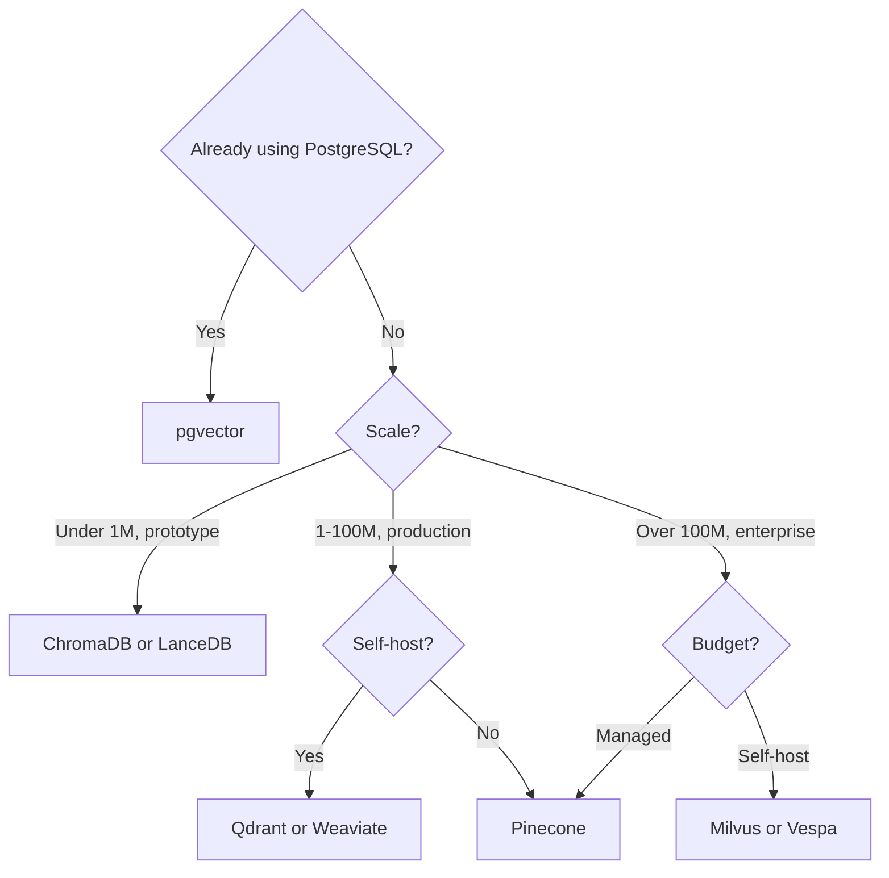

# Appendix D — Vector Database Comparison Matrix

*Last updated: February 2025*

---

## D.1 Architecture Comparison

| System | Language | License | Architecture | Deployment |
|--------|---------|---------|-------------|-----------|
| **Pinecone** | Unknown | Proprietary | Managed cloud | SaaS only |
| **Weaviate** | Go | BSD-3 | Monolithic binary | Self-host / Cloud |
| **Qdrant** | Rust | Apache-2.0 | Segments + Raft | Self-host / Cloud |
| **Milvus** | Go/C++ | Apache-2.0 | Microservices | Self-host / Zilliz Cloud |
| **ChromaDB** | Python | Apache-2.0 | Embedded / Client-server | Self-host |
| **pgvector** | C | PostgreSQL | PostgreSQL extension | Anywhere PG runs |
| **LanceDB** | Rust | Apache-2.0 | Embedded, columnar | Self-host |
| **Vespa** | Java/C++ | Apache-2.0 | Distributed platform | Self-host / Cloud |

---

## D.2 Index and Search Features

| System | HNSW | IVF | PQ/SQ | Disk Index | Hybrid Search | Filtering |
|--------|------|-----|-------|-----------|--------------|-----------|
| Pinecone | ✅ | ✅ | ✅ | ✅ | ✅ (sparse-dense) | ✅ |
| Weaviate | ✅ | ❌ | ✅ (SQ) | ❌ | ✅ (BM25 + vector) | ✅ |
| Qdrant | ✅ | ❌ | ✅ (SQ + PQ) | ✅ (mmap) | ✅ (sparse + dense) | ✅ |
| Milvus | ✅ | ✅ | ✅ | ✅ (DiskANN) | ✅ | ✅ |
| ChromaDB | ✅ | ❌ | ❌ | ❌ | ❌ | ✅ (basic) |
| pgvector | ✅ | ✅ | ❌ | ❌ | ✅ (via PG FTS) | ✅ (SQL) |
| LanceDB | ✅ | ✅ | ✅ | ✅ | ✅ | ✅ (SQL) |
| Vespa | ✅ | ❌ | ❌ | ❌ | ✅ (native) | ✅ |

---

## D.3 Scale and Performance

| System | Max Vectors (Tested) | Dimensions | Replicas | Sharding |
|--------|---------------------|-----------|----------|---------|
| Pinecone | Billions (managed) | Up to 20K | Automatic | Automatic |
| Weaviate | ~100M per node | Up to 65K | ✅ | ✅ (hash) |
| Qdrant | ~100M per node | Up to 65K | ✅ (Raft) | ✅ |
| Milvus | Billions (cluster) | Up to 32K | ✅ | ✅ (time-based) |
| ChromaDB | ~1M (embedded) | No limit | ❌ | ❌ |
| pgvector | ~10M (practical) | Up to 2000 | PG replicas | PG partitioning |
| LanceDB | ~100M | Up to 2048 | ❌ | ❌ |
| Vespa | Billions (cluster) | Up to 65K | ✅ | ✅ |

---

## D.4 API and Ecosystem

| System | API | SDKs | LangChain | LlamaIndex |
|--------|-----|------|-----------|------------|
| Pinecone | REST, gRPC | Python, Node, Go, Java | ✅ | ✅ |
| Weaviate | REST, GraphQL, gRPC | Python, JS, Go, Java | ✅ | ✅ |
| Qdrant | REST, gRPC | Python, JS, Rust, Go | ✅ | ✅ |
| Milvus | gRPC, REST | Python, Java, Go, Node | ✅ | ✅ |
| ChromaDB | Python, REST | Python, JS | ✅ | ✅ |
| pgvector | SQL | Any PG driver | ✅ | ✅ |
| LanceDB | Python, REST | Python, JS | ✅ | ✅ |
| Vespa | REST, Java | Python, Java | ✅ | ✅ |

---

## D.5 Decision Guide

---

## D.6 Pricing Comparison (as of Feb 2025)

!!! note "Prices are approximate"
    Managed service pricing changes frequently. Self-hosted costs depend on instance type and provider.

| System | Free Tier | Starting Price | For 10M vectors (768-dim) |
|--------|----------|---------------|--------------------------|
| Pinecone | 100K vectors | ~$70/month (s1.x1) | ~$250/month |
| Weaviate Cloud | 1M vectors (sandbox) | ~$25/month | ~$300/month |
| Qdrant Cloud | 1M vectors (free) | ~$9/month | ~$150/month |
| Zilliz Cloud (Milvus) | 100K vectors | ~$65/month | ~$400/month |
| pgvector (self-host) | N/A | EC2/RDS cost | ~$200/month (r6g.xlarge) |
