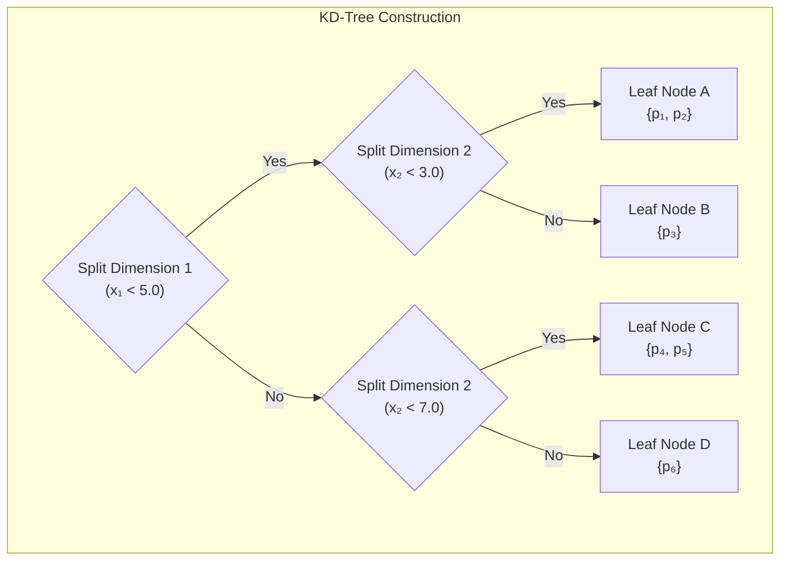
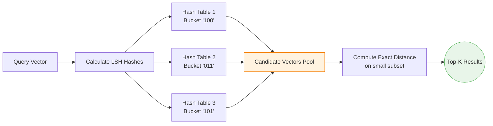
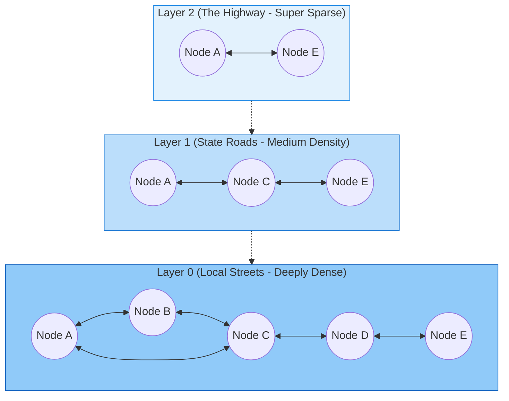
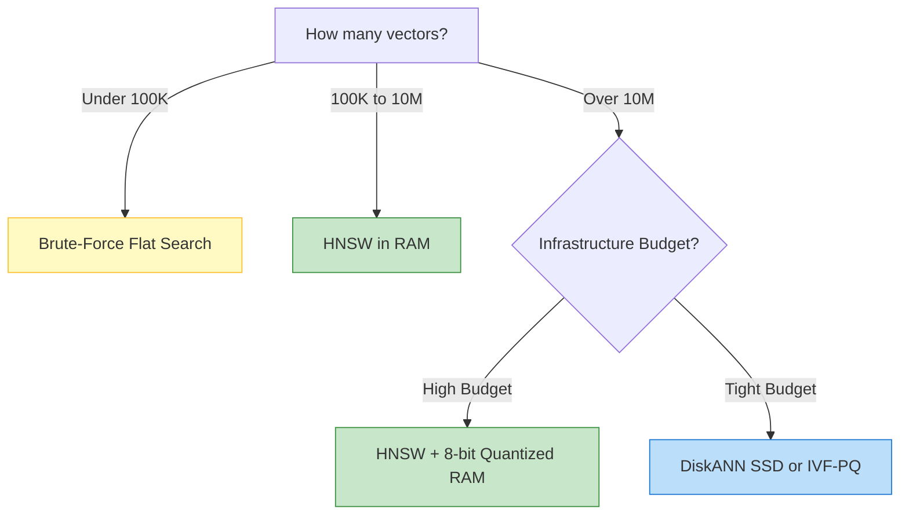

# 2. Approximate Nearest Neighbor (ANN) Algorithms

An exact, brute-force search requires calculating the distance between your query and *every single vector* in the database — an $O(n \cdot d)$ operation per query. At a billion vectors and 768 dimensions, that represents **thousands of gigabytes of raw math per query**. 

To make real-time applications possible, vector databases abandon the idea of finding the *absolute perfect* nearest neighbor. Instead, they use algorithms that guarantee they will find an exceptionally close neighbor, just much faster. This chapter covers the four major families of **Approximate Nearest Neighbor (ANN)** algorithms that power the industry.

---

## 2.1 Exact vs. Approximate Search

### Why Approximate?

| | Exact k-NN | Approximate k-NN |
|---|---|---|
| **Complexity** | $O(n \cdot d)$ | $O(\text{polylog}(n) \cdot d)$ |
| **Search Time (1B vectors)** | Minutes | Milliseconds |
| **Accuracy (Recall)** | 1.0 (Mathematically perfect) | 0.90–0.99 (Tunable) |

**ELI5**: Exact search is like finding a phone number by reading the phonebook from page 1 to page 500, checking every single name. Approximate search is like using an index to flip directly to the "S" section, and grabbing the first number that mostly matches your intent. It takes milliseconds, and 95% of the time, you get the person you actually wanted.

The key metric measuring this accuracy is **Recall@k**: Out of the true mathematical top $k$ results, what percentage did our fast algorithm successfully find? 

$$
\text{Recall@}k = \frac{|\mathcal{R}_{\text{approx}} \cap \mathcal{R}_{\text{exact}}|}{k}
$$

For applications like Retrieval Augmented Generation (RAG) or recommendations, a recall of 95% is functionally indistinguishable to end-users from 100%.

---

## 2.2 Tree-Based Methods

Tree-based methods slice the spatial universe into smaller and smaller boxes, helping queries narrow down where points live.

### KD-Trees

A **KD-tree** splits space by drawing a line strictly along one dimension (e.g., the X-axis), then looking inside those boxes and splitting them along another dimension (e.g., the Y-axis), and so on.



!!! warning "Why KD-trees fail for AI"
    KD-trees are brilliant for 2D maps or 3D video game rendering. However, in 768 dimensions, the "boxes" become incredibly complex. Because of the curse of dimensionality, a query point will often sit awkwardly close to hundreds of box boundaries. The algorithm is forced to backtrack and check almost every box, devolving purely into a slow brute-force scan.

### Ball Trees and VP-Trees

Instead of drawing straight lines to form boxes, **Ball Trees** draw intersecting circles (hyper-spheres) around clusters of points. 

**Vantage-Point Trees (VP-Trees)** pick a random central "Vantage Point" and split the data into "points closer than the median" and "points further than the median". These spherical approaches survive slightly better in higher dimensions than KD-trees, but still largely degrade past 50 dimensions.

---

## 2.3 Hashing-Based Methods (LSH)

### Core Idea

Traditional database hashing guarantees that `hash("apple")` always equals exactly `hash("apple")`, but `hash("app")` yields a totally different random string. This is terrible for similarity searches.

**Locality-Sensitive Hashing (LSH)** flips this logic. LSH creates a mathematical hash function where **similar inputs produce identical outputs**. 

**ELI5**: Imagine slicing a room full of people in half randomly with a laser pointer. You assign everyone on the left a `0` and everyone on the right a `1`. You do this 5 times from different angles. If Bob and Alice are standing right next to each other, there is a very high probability they will end up with the exact same 5-digit code (e.g., `10110`). The query just calculates its own code, goes to the `10110` bucket, and only compares distances against the people inside that bucket.

### Random Hyperplane LSH (Cosine Similarity)

Each slice (hash function) tests which side of a random plane a vector sits on:

$$
h(\mathbf{x}) = \text{sign}(\mathbf{r} \cdot \mathbf{x}), \quad \mathbf{r} \sim \mathcal{N}(0, I_d)
$$

### Multi-Table Routing

To prevent false negatives (Alice and Bob accidentally getting split by a laser), we build multiple tables. If a point shares a bucket in **at least one** out of $L$ tables, we consider it a candidate.



??? example "C++ Implementation: Random Hyperplane LSH (click to expand)"
    ```cpp
    --8<-- "src/cpp/lsh.hpp:random_hyperplane_lsh"
    ```

---

## 2.4 Graph-Based Methods

### Hierarchical Navigable Small World (HNSW)

**HNSW is currently the undisputed king of vector search.** It powers almost every major production vector database today (Pinecone, Qdrant, Weaviate, Milvus).

It is based on the idea of a "Small World Network" — much like the "Six Degrees of Kevin Bacon". You don't need to know everyone in the world; you just need to know a few distant hubs, and a few local neighbours, and you can navigate to anyone in a few hops.

**ELI5**: Imagine navigating a highway system. To get from a small town in Texas to a small town in New York, you don't drive on local backroads the whole way. You:
1. Drive local roads to the nearest interstate highway on-ramp.
2. Hop on the massive, sparse interstate system spanning the country.
3. Exit near New York and take local dense streets to the exact address.

HNSW builds exactly this: a multi-layered graph. The top layers are the "interstate", holding only a few sparse points that span vast distances. The bottom layer contains every single vector in dense "local streets". 



#### HNSW Algorithm: Querying

1. Start at a predefined entry point on the topmost layer.
2. Look at the neighbours. Jump strictly to the neighbour that is mathematically closer to your query.
3. Keep jumping until every neighbour is further away than the point you are currently standing on (a local minimum).
4. Drop down to the next layer and repeat, using your current spot as the new starting point.
5. Keep dropping until you hit Layer 0. The points you arrive at are your nearest neighbours.

| Key Parameter | Default | Effect on Database |
|-----------|---------|--------|
| `M` (Max connections) | 16-64 | Determines how many "highways" connect. Higher means much higher recall accuracy, but significantly more RAM usage. |
| `ef_construction` | 200 | Search quality during graph building. Higher means a better quality graph, but takes vastly longer to import data. |
| `ef_search` | 50+ | The width of the "net" cast during a user query. Higher means more accurate search results, but higher latency. |

??? example "C++ Implementation: HNSW Index (click to expand)"
    ```cpp
    --8<-- "src/cpp/hnsw.hpp:hnsw_index"
    ```

### Vamana / DiskANN

HNSW relies heavily on storing the entire graph structure in RAM to execute those quick multi-layer hops, which becomes prohibitively expensive at billion-scale datasets. **DiskANN/Vamana** is an algorithm designed by Microsoft specifically to store the graph mostly on NVMe SSD drives. It utilizes asynchronous I/O batch reads to fetch neighborhoods from disk, pulling latencies down to <5ms despite operating on cheap storage.

---

## 2.5 Quantization-Based Methods

High-dimensional data eats massive amounts of RAM. Quantization is the mathematical technique of brutally compressing vectors while trying to retain their semantic shape.

### Product Quantization (PQ)

**Product Quantization** breaks massive vectors up into tiny sub-chunks, and replaces the massive arrays of random floats with tiny 8-bit integers.

**ELI5**: Imagine trying to store highly detailed RGB color codes for a photograph (e.g. `[251.3, 12.1, 88.9]`). Instead of storing those exact floats, you look at an 8-color crayon box. You decide that pixel looks closest to "red". So instead of storing 3 floats, you just store the ID number `2` (the red crayon). You've lost some fine detail, but you compressed the pixel massively. 

PQ does this, but for 768-dimensional language vectors. It chops a 768-dim vector into 32 sub-chunks, finds the "closest crayon colour" for each chunk, and stores 32 bytes instead of 3072 bytes (a massive 96x compression).

#### Asymmetric Distance Computation (ADC)

When the query comes in, it is **not** quantized. We compute the exact distance between the pure uncompressed query vector, and the tiny compressed memory codes. 

| Step | Complexity |
|------|-----------|
| Look up pre-calculated table | $O(M \cdot K \cdot d_s)$ — once per query |
| Scan $n$ codes in DB | $O(n \cdot M)$ — just fast integer lookups, no math |

??? example "C++ Implementation: Product Quantizer (click to expand)"
    ```cpp
    --8<-- "src/cpp/pq.hpp:product_quantizer"
    ```

---

## 2.6 Hybrid and Composite Indexes

Production systems mix and match these theories for maximum power. The most common combination historically used in libraries like Meta's FAISS is **IVF-PQ** (Inverted File Index with Product Quantization).

1. **IVF**: Group the entire space into distinct clusters (voronoi cells).
2. **PQ**: Compress all vectors inside those clusters aggressively.
3. **Query**: Find the closest 12 clusters to the query, jump into them, and scan the heavily compressed PQ codes inside.

??? example "C++ Implementation: IVF Index (click to expand)"
    ```cpp
    --8<-- "src/cpp/ivf.hpp:ivf_index"
    ```

---

## 2.7 Algorithm Selection Guide



---

# Assignment: Implement a K-Means IVF Index

In Chapter 0, you built a naive "Index" that hardcoded two buckets based on whether the first dimension was positive or negative. In this assignment, you will upgrade your `FastMiniVectorDB` to use a true **Inverted File Index (IVF)** based on K-Means centroids.

### Goal
Define $K$ centroids (for example, $K=4$). Write an ingestion pipeline that calculates the distance between a new vector and all 4 centroids, and pushes the vector ID into the bucket (inverted list) of the closest centroid. During search, implement the `nprobe` parameter to only scan the 2 closest buckets.

```cpp title="Exercise: Implement IVF"
#include <vector>
#include <iostream>
#include <limits>

class IVFVectorDB {
private:
    std::unordered_map<size_t, Record> storage;
    size_t next_id = 1;

    // The K Centroids (e.g., K = 4)
    std::vector<std::vector<float>> centroids;

    // The Inverted Lists (Buckets). Maps a centroid index (0 to K-1) 
    // to a list of Vector IDs.
    std::vector<std::vector<size_t>> inverted_lists;

public:
    IVFVectorDB(const std::vector<std::vector<float>>& initial_centroids) {
        centroids = initial_centroids;
        inverted_lists.resize(centroids.size());
    }

    size_t insert(const std::vector<float>& vec) {
        size_t id = next_id++;
        storage[id] = {id, vec, ""};

        // EXERCISE 1: Find the nearest centroid
        int best_centroid_idx = -1;
        float min_dist = std::numeric_limits<float>::max();

        /* Write your loop here: compare `vec` to all `centroids` */

        // Push to the correct bucket
        if (best_centroid_idx != -1) {
            inverted_lists[best_centroid_idx].push_back(id);
        }
        return id;
    }

    std::vector<SearchResult> search(const std::vector<float>& query, int k, int nprobe) {
        // EXERCISE 2: Implement nprobe routing
        // 1. Find the distance from `query` to all `centroids`.
        // 2. Sort the centroids by distance.
        // 3. Take the top `nprobe` closest centroids.
        // 4. Iterate *only* over the `inverted_lists` belonging to those specific centroids.
        // 5. Calculate exact distances and return the top-K.
        
        std::vector<SearchResult> results;
        
        /* Write your routing and scanning logic here */

        return results;
    }
};
```

---

## References

1. Malkov, Y. A., & Yashunin, D. A. (2020). *Efficient and Robust Approximate Nearest Neighbor Search Using HNSW Graphs*. IEEE TPAMI.
2. Jegou, H., Douze, M., & Schmid, C. (2011). *Product Quantization for Nearest Neighbor Search*. IEEE TPAMI.
3. Subramanya, S. J., et al. (2019). *DiskANN: Fast Accurate Billion-point Nearest Neighbor Search on a Single Node*. NeurIPS.
4. Indyk, P., & Motwani, R. (1998). *Approximate Nearest Neighbors: Towards Removing the Curse of Dimensionality*. STOC.
