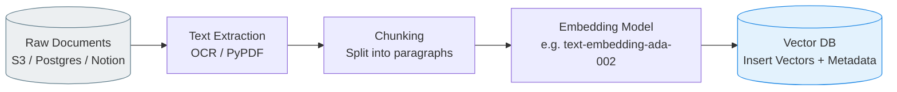

# 5. Data Ingestion & Vectorization Pipelines

Vector databases are entirely "dumb" to human language. If you send the string `"Hello World"` to Milvus, it will throw an error. A vector database is strictly a math engine—it stores coordinates and calculates distances between them. 

The most critical factor in the success of an AI application is not the database you choose, but the **Data Ingestion Pipeline** that sits *in front* of the database. This pipeline translates messy human realities (PDFs, customer support transcripts, images) into highly structured math (dense embeddings).

This chapter breaks down the theory and practice of ingestion pipelines.

---

## 5.1 The Journey from Document to Vector

The ingestion pipeline generally follows a strict sequence of operations:

If any step in this sequence is configured poorly, the search accuracy of your entire system will crash, regardless of how perfectly you tuned your HNSW graph parameters in the database.

---

## 5.2 The Science of Chunking

You cannot feed an entire 500-page book into an embedding model and get a single 768-dimensional vector back. Neural network embedding models have strict **context windows** (usually between 512 and 8,000 tokens). Furthermore, even if a model *could* process 500 pages, a single vector cannot mathematically represent 500 pages of distinct ideas simultaneously (this phenomenon is called "semantic collapse").

To solve this, we parse huge documents into tiny, distinct **Chunks**. 

### Chunking Strategies

There is no "perfect" chunking size; it entirely depends on the nature of the questions your users will ask.

| Strategy | How it works | When to use it |
|----------|--------------|----------------|
| **Fixed-Size (Token) Chunking** | Strictly split text every 300 tokens, regardless of grammar. | Fast baseline. But it often cuts sentences perfectly in half, destroying the semantic meaning. |
| **Sentence-Window Chunking** | Split strictly by periods (`.`). Create chunks that are "Sentence X, plus 2 sentences before and after". | High precision for factual QA systems. Preserves local context perfectly. |
| **Recursive Character Chunking** | Tries to split by double-newline `\n\n` (paragraphs). If a paragraph is too long, it falls back to single newlines, then spaces. | The most common industry default (LangChain's default). Respects author's structural intent. |
| **Semantic Chunking** | Calculates real-time cosine distance *between continuous sentences*. If two sentences are mathematically far apart, it assumes a topic shift occurred and splits the chunk there. | Cutting-edge. Produces highly cohesive chunks, but is incredibly slow / expensive to compute during ingestion. |

**The Golden Rule of Chunk Overlap:** When using size-based chunking, you must always enable an "overlap" (e.g., chunks of 300 tokens, with 50 tokens of overlap). Otherwise, a crucial fact might be split perfectly down the middle between Chunk A and Chunk B, causing neither chunk to contain sufficient context to match a user's prompt.

---

## 5.3 Embedding Models Explained

An embedding model is a supervised deep learning model (typically an Encoder-only Transformer like BERT) trained via **Contrastive Learning**.

In contrastive learning, the model is shown three things: an "Anchor" sentence (e.g. *"What is a cat?"*), a "Positive" sentence (e.g. *"Felines are mammals"*), and a "Negative" sentence (e.g. *"Cars have 4 wheels"*). The neural network adjusts its internal weights to pull the Anchor and Positive closer together in 768-dimensional space, and push the Anchor and Negative further apart.

After seeing billions of these triplets, the model learns the geometric layout of human language semantics.

### Families of Embedding Models

1. **Symmetric (Semantic Similarity):** Best for matching user queries against other user queries (e.g., deduplicating a support forum). Both inputs are the same size and tone. (e.g., `all-MiniLM-L6-v2`).
2. **Asymmetric (QA / Retrieval):** Best for standard Retrieval Augmented Generation (RAG). The user query is short ("How do I reset my password?"), but the target document is long (a huge IT manual). The model is specifically trained to map short questions to long answers.
3. **Multi-Modal (CLIP):** The model is trained on both text and images simultaneously. The sentence "A golden retriever playing" produces the exact same vector as a JPEG photograph of a golden retriever playing.

### Benchmarking Models (MTEB)

Because building new embedding models is a highly competitive space between companies like OpenAI, Cohere, BGE, and Nomic, the industry relies on the **MTEB (Massive Text Embedding Benchmark)**. 

MTEB tests an embedding model against 100+ different tasks (classification, clustering, retrieval) across 100+ languages to provide an aggregate score. Before starting a project, engineers check the HuggingFace MTEB Leaderboard to select the current State of the Art model that fits their latency budget.

---

## 5.4 Metadata Extraction & Decoration

A raw chunk of text is not enough. To power Hybrid Search (Chapter 10) and enable the vector database to restrict searches, the ingestion pipeline must extract scalar data.

If a chunk is a paragraph from an SEC 10-K filing, the pipeline should extract:
* `ticker`: "AAPL"
* `year`: 2024
* `section`: "Risk Factors"

During ingestion, the pipeline stitches the 768-D float array generated by the embedding model together with this JSON metadata dictionary, creating the final **Payload** that is transmitted to the Vector Database API (described in Chapter 6).

---

## References

1. Reimers, N., & Gurevych, I. (2019). *Sentence-BERT: Sentence Embeddings using Siamese BERT-Networks*. EMNLP.
2. Muennighoff, N., et al. (2023). *MTEB: Massive Text Embedding Benchmark*. EACL.
3. LangChain Documentation: *Text Splitters*.
