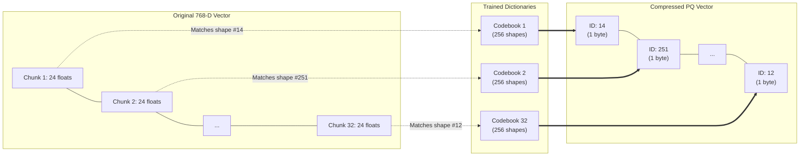

# 3. Index-Storage Trade-offs

A common misconception when building AI applications is that vector databases are just regular databases that happen to support a cosine distance function. In reality, the architecture of a vector database is almost entirely dictated by the harsh physical limitations of computer memory.

In this chapter, we explore the fundamental tension between search speed, recall accuracy, and hardware costs, and examine how quantization techniques are used to aggressively compress vector data.

---

## 3.1 The Memory Math of Vector Search

### Calculating Raw Footprint

Unlike standard relational database rows (which might be a few dozen bytes of integers and short strings), embeddings are massive arrays of floating-point numbers.

Consider OpenAI's `text-embedding-3-small` model, which produces 1536-dimensional vectors.
* A single standard 32-bit float (`f32`) consumes 4 bytes.
* One vector: $1536 \times 4 \text{ bytes} = 6,144 \text{ bytes (or } 6.1 \text{ KB)}$.

If you have a dataset of just 10 million vectors:
$$10,000,000 \times 6.1 \text{ KB} = 61.4 \text{ Gigabytes}$$

That $61.4 \text{ GB}$ is *just* the raw vector data. It does not include the HNSW graph metadata (which often takes *more* memory than the vectors themselves), nor does it include the scalar metadata (the JSON document containing the text, author, and date). 

A 10-million vector index running HNSW effectively requires a dedicated 128GB RAM server. At 1 billion vectors, you are looking at terabytes of RAM, costing tens of thousands of dollars per month to host.

### The Storage Hierarchy Problem

Why can't we just store the vectors on a cheap 1TB hard drive instead of RAM?

As we learned in Chapter 2, graph-based algorithms like HNSW require making dozens or hundreds of "hops" per query. The algorithm looks at Node A, decides to jump to Node B, then Node X. These jumps are entirely unpredictable and non-sequential.

| Storage Medium | Random Access Latency | Bandwidth | Cost / TB |
|----------------|-----------------------|-----------|-----------|
| **L3 Cache** | ~10 ns | 1000+ GB/s | N/A |
| **DRAM (RAM)** | ~100 ns | ~100 GB/s | ~$3,000 |
| **NVMe SSD** | ~10,000 ns (10 µs) | ~5 GB/s | ~$100 |

If a query requires 200 random node memory lookups:
* **In RAM**: $200 \times 100\text{ns} = 0.02\text{ms}$. Lightning fast.
* **On SSD**: $200 \times 10\text{µs} = 2.0\text{ms}$. Slow, but acceptable.

However, if you have 1,000 users querying per second, the SSD Queue Depth explodes. The SSD cannot handle 200,000 random IOPS simultaneously without suffering massive latency spikes. To scale throughput, the hot index **must** live in RAM.

---

## 3.2 Navigating the "CAP-like" Theorem of Vector DBs

In distributed systems, the CAP theorem states you can only choose two out of three: Consistency, Availability, Partition tolerance.

Vector databases have a similar triangular trade-off rule governing their indexes:

1. **Query Latency (Speed)**: How fast does a search return? (e.g., < 20ms).
2. **Recall (Accuracy)**: What percentage of the mathematically true top-$k$ results are successfully found?
3. **Memory Footprint (Cost)**: How much RAM does the index consume?

You can mathematically only optimize for two at the expense of the third.

* **Want high recall and fast queries?** You must use uncompressed HNSW, which maximizes memory footprint and triples your AWS bill.
* **Want low memory and fast queries?** You must compress the vectors heavily (Quantization), which mathematically degrades your recall accuracy.
* **Want high recall and low memory?** You must pull the index off RAM and put it on SSD (DiskANN), which increases your query latency from 2ms to 20ms.

---

## 3.3 Vector Compression: Quantization

To break the boundary of the trade-off triangle, engineers developed **Quantization**. Quantization is a lossy compression algorithm designed specifically to shrink high-dimensional vectors while retaining enough geometric "shape" to still execute accurate cosine distances.

### Scalar Quantization (SQ)

The simplest form of compression. Standard vectors use 32-bit floats (`f32`), which offer incredible precision (7 decimal places). But do we really need that much precision to determine if a vector is generally pointing towards "Cats" or "Dogs"? No.

Scalar Quantization (SQ8) simply maps the minimum and maximum values of the vector dataset into an 8-bit integer range (0 to 255). 

$$ \text{int8} \approx \text{round}\left(255 \times \frac{x - x_{\min}}{x_{\max} - x_{\min}}\right) $$

* **Impact**: Immediately reduces memory usage by 4x (32 bits down to 8 bits).
* **Trade-off**: You lose extreme fine-grained distance differentiation, leading to a slight drop in recall (usually < 2%).

### Product Quantization (PQ)

When a 4x reduction isn't enough to fit a billion vectors in RAM, we use **Product Quantization (PQ)**. It is significantly more complex, and provides massive compression ratios (up to 96x).

Instead of compressing individual numbers, PQ discovers patterns inside the vectors using clustering.

1. **Subspace Splitting**: Take a 768-D vector. Chop it into 32 separate "chunks" of 24 dimensions each.
2. **K-Means Dictionary Construction**: For Chunk #1, look at all 1 million vectors. Run k-means to find 256 common "shapes" (centroids) that Chunk #1 tends to look like. Assign each of these 256 shapes an ID from 0 to 255. Do this for all 32 chunks.
3. **Encoding**: Now, to store a new 768-D vector, we don't store floats. We just look at Chunk #1, find the ID of the centroid it most closely matches (say, ID 14), and store `14`. We do this for all 32 chunks.

Using PQ, the entire 768-dimensional float array (3,072 bytes) is replaced by just an array of **32 bytes** (the IDs).



**Asymmetric Distance Computation (ADC):** When a user executes a query, tracking down distances against these tiny compressed byte IDs requires looking up the original float distances in a pre-computed math table. PQ searches are highly efficient for memory, but significantly mathematically complex compared to raw L2 distance. (See the C++ implementation in Chapter 2).

### Binary Quantization (BQ)

The most extreme form of compression takes a 32-bit float and crushes it down to a single mathematical bit (`1` or `0`). 

If a dimension in a vector is greater than `0.0`, BQ assigns it a `1`. If it is less than `0.0`, BQ assigns it a `0`. An entire 768-dimensional float vector (3072 bytes) becomes a string of just 768 bits (96 bytes). 

* **Impact**: Phenomenal 32x memory compression. More importantly, computing the distance between two BQ vectors does not require floating-point math. The CPU uses a bitwise `XOR` followed by a `popcount` (counting the number of '1's), which executes effectively instantly on modern hardware.
* **Trade-off**: Enormous precision loss. BQ only works well with specific embedding models (like OpenAI's `text-embedding-3-*` or Cohere) that inherently distribute their vector dimensions evenly around the origin (0.0).

### Overfetching and Rescoring

Because quantization (SQ, PQ, BQ) introduces literal geometric distortion—you are physically moving the vectors slightly to compress them—the mathematical distance calculations will be slightly wrong. 

To maintain high Recall accuracy, modern vector databases use a two-phase query pipeline known as **Overfetching and Rescoring**:

1. **Phase 1: Overfetch (Fast)**. The database uses the heavily compressed vectors in RAM to rapidly find the "Top 100" candidates for the user's query.
2. **Phase 2: Rescore (Precise)**. The database takes the exact IDs of those 100 candidates, goes to the slow SSD, fetches the *original uncompressed 32-bit float vectors* just for those 100 items, recalculates the exact pristine L2/Cosine distances, and returns the true "Top 10" to the user.

By overfetching 10x the needed results using compressed data during the heavy graph search, and only rescoring the final tiny handful using exact uncompressed data from disk, databases achieve the best of both worlds: extreme speed, low RAM usage, and near-perfect accuracy.

---

## Conclusion

Understanding the Index-Storage trade-off is critical. As an architect, your primary task when designing a vector search feature is:
1. Estimate your final dataset size. (Calculated in GB of vectors).
2. Determine your hardware budget.
3. Apply SQ or PQ quantization aggressively until the dataset fits comfortably within 60% of your allocated RAM (leaving 40% for the OS, Graph metadata, and query buffers).

---

## 🛠 Assignment: Implement Scalar Quantization

Now that you understand the theory behind quantization, let's build a working **Scalar Quantization (SQ8)** engine in C++. This exercise teaches you how production databases achieve 4x memory savings.

**Your tasks:**
1. Implement `quantize()` — map a `float32` vector to `uint8` (0–255).
2. Implement `dequantize()` — recover approximate floats from `uint8`.
3. Implement `l2_distance_quantized()` — compute L2 distance directly on `uint8` arrays (fast integer math).
4. Compare recall of quantized search vs. exact float search.

```cpp title="Exercise: Implement Scalar Quantization"
#include <iostream>
#include <vector>
#include <cstdint>
#include <cmath>
#include <algorithm>
#include <random>
#include <cassert>

// ── Step 1: Quantization Parameters ──────────────────
// Find the global min/max across the dataset to define the mapping range.
struct SQParams {
    float global_min;
    float global_max;
    float scale;      // (max - min) / 255
    float inv_scale;  // 255 / (max - min)
};

SQParams compute_sq_params(const std::vector<std::vector<float>>& dataset) {
    float gmin = std::numeric_limits<float>::max();
    float gmax = std::numeric_limits<float>::lowest();
    for (const auto& vec : dataset) {
        for (float v : vec) {
            gmin = std::min(gmin, v);
            gmax = std::max(gmax, v);
        }
    }
    float range = gmax - gmin;
    if (range == 0.0f) range = 1.0f;
    return {gmin, gmax, range / 255.0f, 255.0f / range};
}

// ── Step 2: Quantize float32 → uint8 ────────────────
std::vector<uint8_t> quantize(const std::vector<float>& vec,
                              const SQParams& params) {
    std::vector<uint8_t> qvec(vec.size());
    for (size_t i = 0; i < vec.size(); ++i) {
        float normalized = (vec[i] - params.global_min) * params.inv_scale;
        qvec[i] = static_cast<uint8_t>(
            std::clamp(std::round(normalized), 0.0f, 255.0f));
    }
    return qvec;
}

// ── Step 3: Dequantize uint8 → float32 ──────────────
std::vector<float> dequantize(const std::vector<uint8_t>& qvec,
                              const SQParams& params) {
    std::vector<float> vec(qvec.size());
    for (size_t i = 0; i < qvec.size(); ++i) {
        vec[i] = static_cast<float>(qvec[i]) * params.scale + params.global_min;
    }
    return vec;
}

// ── Step 4: L2 Distance on uint8 (Integer Math) ─────
// This runs ~4x faster than float L2 because uint8 fits 
// 4x more values in the same cache line.
uint32_t l2_distance_quantized(const std::vector<uint8_t>& a,
                               const std::vector<uint8_t>& b) {
    uint32_t sum = 0;
    for (size_t i = 0; i < a.size(); ++i) {
        int32_t diff = static_cast<int32_t>(a[i]) - static_cast<int32_t>(b[i]);
        sum += diff * diff;
    }
    return sum;
}

// ── Step 5: Exact float L2 distance (for comparison) ─
float l2_distance_float(const std::vector<float>& a,
                        const std::vector<float>& b) {
    float sum = 0.0f;
    for (size_t i = 0; i < a.size(); ++i) {
        float diff = a[i] - b[i];
        sum += diff * diff;
    }
    return sum;
}

// ── Step 6: Brute-force k-NN using quantized vectors ─
std::vector<size_t> knn_quantized(const std::vector<std::vector<uint8_t>>& db,
                                  const std::vector<uint8_t>& query, size_t k) {
    std::vector<std::pair<uint32_t, size_t>> dists;
    for (size_t i = 0; i < db.size(); ++i) {
        dists.push_back({l2_distance_quantized(db[i], query), i});
    }
    std::partial_sort(dists.begin(), dists.begin() + k, dists.end());
    std::vector<size_t> result(k);
    for (size_t i = 0; i < k; ++i) result[i] = dists[i].second;
    return result;
}

// ── Main: Demonstrate compression ratio and recall ───
int main() {
    const size_t N = 10000, DIM = 128, K = 10;
    std::mt19937 rng(42);
    std::uniform_real_distribution<float> dist(-1.0f, 1.0f);

    // Generate random dataset
    std::vector<std::vector<float>> dataset(N);
    for (auto& v : dataset) {
        v.resize(DIM);
        for (auto& x : v) x = dist(rng);
    }

    // Generate query
    std::vector<float> query(DIM);
    for (auto& x : query) x = dist(rng);

    // Compute exact ground truth (float32 brute force)
    std::vector<std::pair<float, size_t>> exact_dists;
    for (size_t i = 0; i < N; ++i)
        exact_dists.push_back({l2_distance_float(dataset[i], query), i});
    std::partial_sort(exact_dists.begin(), exact_dists.begin() + K,
                      exact_dists.end());

    // Quantize the entire dataset
    auto params = compute_sq_params(dataset);
    std::vector<std::vector<uint8_t>> qdb(N);
    for (size_t i = 0; i < N; ++i)
        qdb[i] = quantize(dataset[i], params);
    auto qquery = quantize(query, params);

    // Run quantized k-NN
    auto qresults = knn_quantized(qdb, qquery, K);

    // Compute recall@K
    size_t hits = 0;
    for (size_t i = 0; i < K; ++i) {
        for (size_t j = 0; j < K; ++j) {
            if (qresults[i] == exact_dists[j].second) { hits++; break; }
        }
    }
    float recall = static_cast<float>(hits) / K;

    // Print results
    std::cout << "=== Scalar Quantization Exercise ===" << std::endl;
    std::cout << "Dataset: " << N << " vectors × " << DIM << "D" << std::endl;
    std::cout << "Float32 size: " << (N * DIM * 4) / 1024 << " KB" << std::endl;
    std::cout << "Uint8   size: " << (N * DIM * 1) / 1024 << " KB" << std::endl;
    std::cout << "Compression:  4x" << std::endl;
    std::cout << "Recall@" << K << ":     " << recall * 100 << "%" << std::endl;

    assert(recall >= 0.8f && "Recall should be >= 80% for SQ8");
    std::cout << "✅ Assertion passed!" << std::endl;
    return 0;
}
```

**Compile and run:**
```bash
g++ -std=c++17 -O2 -o scalar_quantization scalar_quantization.cpp
./scalar_quantization
```

---

## References

1. Jegou, H., Douze, M., & Schmid, C. (2011). *Product Quantization for Nearest Neighbor Search*. IEEE TPAMI.
2. Pinecone Documentation. *Memory and Storage Tradeoffs*.
