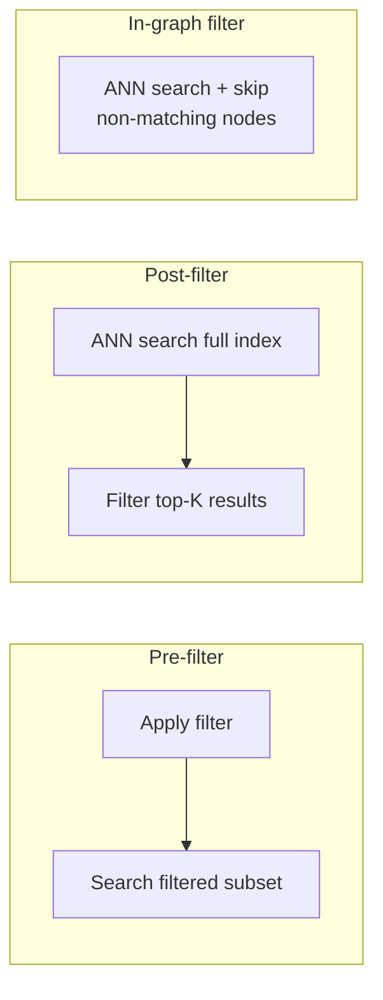

# 4. Query Semantics & Vector Similarities

Beyond "find the $k$ closest vectors," real applications demand **hybrid queries** that mix vector similarity with metadata filters, multi-vector representations, and cost-aware query planning.

---

## 4.1 Exact vs. Approximate Search

### When Exact Search Is Feasible

$$
\text{Brute-force cost} = O(n \cdot d)
$$

Rule of thumb: exact search is practical for $n \cdot d < 10^8$ (e.g., 100K vectors × 768-dim = 76.8M operations → ~1ms on modern CPUs).

### Approximation Guarantees

**$\varepsilon$-approximate NN**: Find a point $p$ such that:

$$
d(q, p) \leq (1 + \varepsilon) \cdot d(q, p^*)
$$

where $p^*$ is the true nearest neighbor. LSH provides this guarantee; HNSW does not (but achieves higher recall empirically).

---

## 4.2 k-NN vs. Range Search

| Query Type | Semantics | Use Case |
|-----------|-----------|----------|
| **k-NN** | Return $k$ closest vectors | "Find 10 similar products" |
| **Range ($\varepsilon$-ball)** | Return all vectors within distance $r$ | "Find all near-duplicates" |
| **Threshold** | Return vectors with similarity ≥ $\tau$ | "Find relevant documents (score > 0.8)" |

!!! warning "Range queries are harder to optimize"
    k-NN has a fixed result size; range queries can return 0 or millions of results. Most ANN indexes are optimized for k-NN.

---

## 4.3 Hybrid Predicates (Vector + Filter)

Real queries combine vector similarity with **scalar/text filters**:

```sql
SELECT * FROM documents
WHERE category = 'science' AND year >= 2020
ORDER BY vector_distance(embedding, $query_vec)
LIMIT 10
```

### Three Filtering Strategies



| Strategy | Pros | Cons |
|----------|------|------|
| **Pre-filter** | Exact filter results | May leave too few vectors for good ANN search |
| **Post-filter** | Uses full index quality | May discard most results; need large over-fetch |
| **In-graph filter** | Best of both worlds | Complex implementation; may break graph connectivity |

### Over-fetching Formula for Post-filter

If filter selectivity is $s$ (fraction of vectors passing), fetch:

$$
k' = \frac{k}{s} \cdot \alpha
$$

where $\alpha \approx 1.5\text{–}3$ is a safety factor to account for non-uniform distribution.

---

## 4.4 Multi-Vector Queries

### ColBERT-Style Late Interaction

Instead of one vector per document, use **multiple** vectors (one per token):

$$
\text{score}(q, d) = \sum_{i=1}^{|q|} \max_{j=1}^{|d|} \; \mathbf{q}_i \cdot \mathbf{d}_j
$$

This **MaxSim** operator captures fine-grained token-level interactions.

### Implications for Vector Databases

- Storage: $|d| \times$ more vectors per document (typically 128–512)
- Indexing: Need efficient **multi-vector aggregation**
- Query: Sum of per-token max-sim queries

---

## 4.5 Query Planning and Optimization

### Cost-Based Planning

Given a hybrid query, choose the cheapest execution plan:

$$
\text{Cost}_{\text{pre}} = c_{\text{filter}}(s) + c_{\text{ANN}}(s \cdot n, k)
$$

$$
\text{Cost}_{\text{post}} = c_{\text{ANN}}(n, k') + c_{\text{filter}}(k')
$$

Choose whichever is smaller. High selectivity ($s \ll 1$) favours pre-filter; low selectivity favours post-filter.

### Caching Strategies

| Level | What to Cache | Hit Rate |
|-------|--------------|----------|
| Result cache | Full query results | Low (queries are unique) |
| Vector cache | Hot vectors in memory | High for skewed distributions |
| Centroid cache | IVF centroid distances | Very high (few centroids) |

---

## References

1. Khattab, O., & Zaharia, M. (2020). *ColBERT: Efficient and Effective Passage Search via Contextualized Late Interaction*. SIGIR.
2. Wei, J., et al. (2023). *Filtered-DiskANN: Graph Algorithms for Approximate Nearest Neighbor Search with Filters*. WWW.
