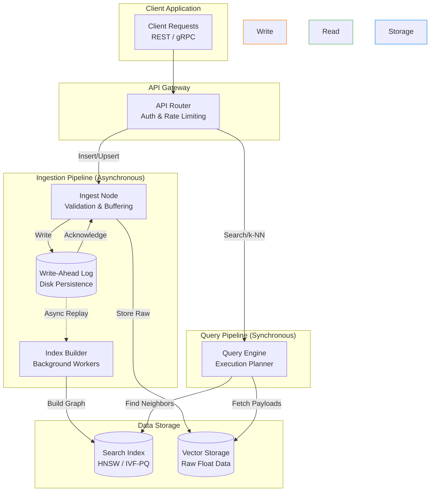

# 6. Core Components

Whether you are using Milvus, Qdrant, Weaviate, or Pinecone, all modern vector databases share a fundamentally similar internal architecture. Unlike traditional relational databases which are primarily concerned with row-based transactions, vector databases are entirely optimized around feeding massive tensors of floats into specialized graph or tree structures. 
This chapter maps out these sub-systems in plain English.

---

## 6.1 System Overview

The fastest way to understand a vector database is to follow the lifecycle of a request as it passes through the system.

When a client sends an embedding vector to be stored, it doesn't just go straight into a search index. It passes through API layers, buffering systems, and durability logs before it is finally constructed into an HNSW graph or IVF cluster.



---

## 6.2 The Ingest Layer

The ingest layer handles your `insert` and `upsert` API payloads. Its job is simply to get data safely accepted as fast as possible so the client isn't waiting.

Because inserting a node into a complex mathematical graph (like HNSW) is mathematically heavy and requires scanning memory, databases almost never do this "synchronously" while the client waits. 

Instead, they use **Buffered Writes**. The database immediately dumps the vectors into a fast, temporary memory buffer. It acknowledges the successful write to the user, and then a background worker quietly handles the intense math required to plug those vectors into the HNSW graph over the next few seconds. This is why a vector database can process 100,000 requests a second, but it might take 2-3 seconds for your new document to appear in search results.

---

## 6.3 The Write-Ahead Log (WAL)

If write requests are sitting around in temporary memory buffers waiting to be calculated into the graph, what happens if the server loses power? All those vectors disappear.

To guarantee **durability** (the 'D' in ACID databases), the database uses a Write-Ahead Log.

1. The client sends a vector insert.
2. The database appends the raw vector to a simple `.log` file on the hard drive. 
3. *Only now* does it tell the client "Success".
4. If the server crashes, on reboot it simply reads the `.log` file and reconstructs the memory buffer.

Writing a single line to a `.log` file is lightning fast. Calculating an HNSW node connection is slow. The WAL decouples the two.

---

## 6.4 The Index Builder

The index builder is the core engine room of the database. These are heavy background threads that drain the WAL and execute the complex algorithms described in Chapter 2. 

Because graph construction is intense, index builders operate on a **segment** architecture. They don't try to build one gigantic monolithic index. They build tiny HNSW indexes containing, for instance, 100,000 vectors at a time. Once a tiny segment is "full", they seal it. 

### Warm-up Delays
If you restart a vector database containing 200 million vectors, it will take significant time (often 1-2 full minutes) merely to read the massive multi-gigabyte HNSW index off the NVMe drive and load it into RAM before it can answer a single search query.

---

## 6.5 The Query Engine

When you search for `"How to train an AI"`, the query engine takes control:

1. **Parse**: Understand if this is just a vector search, or if there are metadata filters (e.g., `author="Google"`).
2. **Plan**: Decide whether to filter the metadata *before* checking the vector index, or *after*. (See Chapter 10).
3. **Execute**: It queries every single sealed Segment concurrently across multiple CPU threads.
4. **Merge**: By finding the "Top 10" from Segment A, Segment B, and Segment C, it mathematically calculates the overall true Top 10 across the entire database.
5. **Enrich**: It takes the Top 10 internal database IDs and goes to the raw Vector Storage to fetch the actual JSON payload, original text, and original float array to return to the user.

---

# Assignment: Implement a Write-Ahead Log (WAL)

To make your `MiniVectorDB` from Chapter 0 durable against crashes, you must implement a Write-Ahead Log. Before modifying the in-memory `unordered_map`, the server must write the command to an append-only file on disk.

### Goal
Implement an `append_to_wal` function that writes raw vector floats to a `.log` file during `insert()`. Write a `recover_from_wal` function that runs when the database boots up, reading the `.log` file and rebuilding the in-memory hash map.

```cpp title="Exercise: Implement the WAL"
#include <fstream>
#include <iostream>
#include <vector>

class DurableVectorDB {
private:
    std::unordered_map<size_t, Record> storage;
    size_t next_id = 1;
    std::ofstream wal_file;

public:
    DurableVectorDB() {
        // Open log file in append & binary mode
        wal_file.open("vectors.log", std::ios::app | std::ios::binary);
        
        // EXERCISE 2: Call recovery on boot
        recover_from_wal();
    }

    ~DurableVectorDB() {
        wal_file.close();
    }

    size_t insert(const std::vector<float>& vec) {
        size_t id = next_id++;
        
        // 1. Durability: Write to disk *first*
        append_to_wal(id, vec);
        
        // 2. State update: Update fast memory *second*
        storage[id] = {id, vec, ""};
        return id;
    }

private:
    void append_to_wal(size_t id, const std::vector<float>& vec) {
        // Write the ID
        wal_file.write(reinterpret_cast<const char*>(&id), sizeof(id));
        
        // Write the size of the vector
        size_t vec_size = vec.size();
        wal_file.write(reinterpret_cast<const char*>(&vec_size), sizeof(vec_size));
        
        // EXERCISE 1: Write the actual float array payload to the file stream
        
        /* Write your serialization code here */

        // Force OS to physically write to SSD
        wal_file.flush(); 
    }

    void recover_from_wal() {
        std::ifstream in_file("vectors.log", std::ios::binary);
        if (!in_file.is_open()) return;

        std::cout << "Recovering DB from WAL..." << std::endl;
        
        // EXERCISE 2: Read the file sequentially until EOF, 
        // parsing out `id` and `vec`, and injecting them straight into `storage`.
        // Don't forget to update `next_id` so new inserts don't overwrite recovered ones!
        
        /* Write your deserialization loop here */
    }
};
```

---

## References

1. Wang, J., et al. (2021). *Milvus: A Purpose-Built Vector Data Management System*. SIGMOD.
2. Qdrant Documentation. *Architecture Overview*. https://qdrant.tech/documentation/
