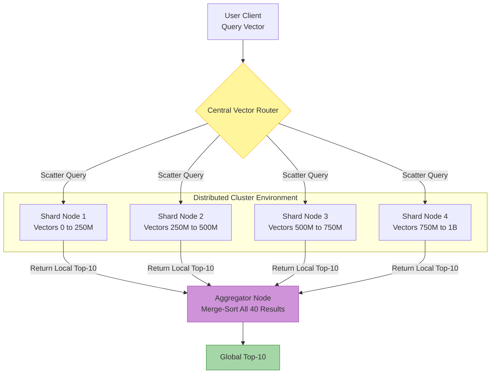

# 8. Distributed Vector Stores

A single powerful physical server with 256GB of RAM can typically hold about 50 to 100 million high-dimensional dense vectors in an HNSW graph. But production workloads at companies like Spotify, Meta, or OpenAI deal with *billions* of vectors representing images, audio clips, and chunks of massive codebases.

When data exceeds the RAM of a single machine, we must distribute our database across a cluster. Splitting a standard database (like Postgres) by User ID is easy. Splitting high-dimensional geometric spaces is deeply complicated.

---

## 8.1 Sharding Strategies

If you have 1 billion vectors, you might split them into four "Shards" of 250 million vectors each, hosted on four separate servers. But when a search query comes in, how do we know which server holds the closest match? 

### Data-Parallel Sharding (The Scatter-Gather Method)

The simplest and most robust approach used by almost all commercial vector databases: **search everywhere at once**.

Because we don't know mathematically where the nearest neighbour is, the central router simply broadcasts the query vector to *all* Shards simultaneously. Every Shard computes its own local Top $K$ closest results. The router then collects these independent lists, merges them, sorts them by distance, and returns the absolute global Top $K$.



**The Catch:** Your overall query is only as fast as your *slowest* individual shard.

---

## 8.2 Replication and High Availability

### Read Replicas for Traffic

Sharding solves the problem of "Too much data to fit in RAM". **Replication** solves the problem of "Too many users querying at the same time".

If you copy Shard 1 onto three identical servers, the system routes incoming questions in a round-robin style across those three servers.

$$
\text{QPS}_{\text{total}} = \text{Replicas} \times \text{QPS}_{\text{per-machine}}
$$

### Consistency Semantics in Vector DBs

When you insert a new vector into a distributed system, it takes a few milliseconds or seconds for that update to physically sync across all replicas over the network.

Traditional databases panic about this (if a bank balance is out of sync, the bank collapses). Vector databases operate differently. 

**Vector databases almost universally prioritize "Eventual Consistency" or "Bounded Staleness".** If a user uploads a new PDF and asks a question about it 200 milliseconds later, there is a tiny chance the query hits a replica that hasn't seen the PDF yet. For semantic similarity search, missing one vector out of a billion temporarily is practically unnoticeable to human users. The trade-off is massive, hyper-fast read availability.

---

## 8.3 Consensus and Orchestration

If a single shard catches fire and the server dies, the cluster needs to reroute traffic to a backup replica within milliseconds. 

Databases handle this via consensus protocols:
* **Raft**: Qdrant compiles the Raft protocol directly into the database binary. Nodes constantly ping each other natively.
* **etcd / Zookeeper**: Milvus relies on dedicated external coordination clustered services to monitor the health of worker nodes. 

---

## 🛠 Assignment: Simulate Scatter-Gather Distributed Search

Let's build a working simulation of the **Scatter-Gather** pattern described in Section 8.1. You will split a dataset across multiple shard nodes, broadcast a query to all shards, and merge-sort the local results into a globally correct Top-K answer.

**Your tasks:**
1. Implement a `ShardNode` that stores vectors and performs local brute-force k-NN.
2. Implement `scatter_query()` to broadcast the query to all shards.
3. Implement `gather_results()` to merge-sort local top-K lists into a global top-K.
4. Verify that the distributed result matches a monolithic (single-node) search.

```cpp title="Exercise: Scatter-Gather Sharding"
#include <iostream>
#include <vector>
#include <algorithm>
#include <random>
#include <cassert>
#include <cmath>

// ── L2 Distance ──────────────────────────────────────
float l2_dist(const std::vector<float>& a, const std::vector<float>& b) {
    float sum = 0;
    for (size_t i = 0; i < a.size(); ++i) {
        float d = a[i] - b[i];
        sum += d * d;
    }
    return sum;
}

struct SearchResult {
    size_t global_id;
    float distance;
    bool operator<(const SearchResult& o) const { return distance < o.distance; }
};

// ── Step 1: A single Shard Node ──────────────────────
// Each shard holds a subset of vectors and can answer local k-NN queries.
class ShardNode {
public:
    void add(size_t global_id, const std::vector<float>& vec) {
        ids_.push_back(global_id);
        data_.push_back(vec);
    }

    // Local brute-force search returning the shard's top-K
    std::vector<SearchResult> local_search(const std::vector<float>& query,
                                           size_t k) const {
        std::vector<SearchResult> results;
        for (size_t i = 0; i < data_.size(); ++i) {
            results.push_back({ids_[i], l2_dist(data_[i], query)});
        }
        size_t n = std::min(k, results.size());
        std::partial_sort(results.begin(), results.begin() + n, results.end());
        results.resize(n);
        return results;
    }

    size_t size() const { return data_.size(); }

private:
    std::vector<size_t> ids_;
    std::vector<std::vector<float>> data_;
};

// ── Step 2: Scatter — broadcast query to all shards ──
std::vector<std::vector<SearchResult>> scatter_query(
    const std::vector<ShardNode>& shards,
    const std::vector<float>& query, size_t k)
{
    std::vector<std::vector<SearchResult>> all_local;
    for (const auto& shard : shards) {
        all_local.push_back(shard.local_search(query, k));
    }
    return all_local;
}

// ── Step 3: Gather — merge-sort into global Top-K ────
std::vector<SearchResult> gather_results(
    const std::vector<std::vector<SearchResult>>& local_results,
    size_t k)
{
    std::vector<SearchResult> merged;
    for (const auto& local : local_results) {
        merged.insert(merged.end(), local.begin(), local.end());
    }
    size_t n = std::min(k, merged.size());
    std::partial_sort(merged.begin(), merged.begin() + n, merged.end());
    merged.resize(n);
    return merged;
}

// ── Main: Verify distributed == monolithic ───────────
int main() {
    const size_t N = 5000, DIM = 64, K = 10, NUM_SHARDS = 4;
    std::mt19937 rng(42);
    std::uniform_real_distribution<float> dist(-1.0f, 1.0f);

    // Generate dataset
    std::vector<std::vector<float>> dataset(N);
    for (auto& v : dataset) {
        v.resize(DIM);
        for (auto& x : v) x = dist(rng);
    }

    // Distribute across shards using hash-based assignment
    std::vector<ShardNode> shards(NUM_SHARDS);
    for (size_t i = 0; i < N; ++i) {
        shards[i % NUM_SHARDS].add(i, dataset[i]);
    }

    // Generate query
    std::vector<float> query(DIM);
    for (auto& x : query) x = dist(rng);

    // Distributed search: scatter + gather
    auto local_results = scatter_query(shards, query, K);
    auto distributed_topk = gather_results(local_results, K);

    // Monolithic ground truth
    std::vector<SearchResult> mono;
    for (size_t i = 0; i < N; ++i)
        mono.push_back({i, l2_dist(dataset[i], query)});
    std::partial_sort(mono.begin(), mono.begin() + K, mono.end());

    // Verify exact match
    bool match = true;
    for (size_t i = 0; i < K; ++i) {
        if (distributed_topk[i].global_id != mono[i].global_id) {
            match = false;
            break;
        }
    }

    std::cout << "=== Scatter-Gather Sharding Exercise ===" << std::endl;
    std::cout << "Dataset: " << N << " vectors across "
              << NUM_SHARDS << " shards" << std::endl;
    for (size_t i = 0; i < NUM_SHARDS; ++i)
        std::cout << "  Shard " << i << ": " << shards[i].size()
                  << " vectors" << std::endl;
    std::cout << "Distributed Top-" << K << " matches monolithic: "
              << (match ? "YES" : "NO") << std::endl;

    assert(match && "Distributed search must match monolithic search!");
    std::cout << "✅ Assertion passed!" << std::endl;
    return 0;
}
```

**Compile and run:**
```bash
g++ -std=c++17 -O2 -o scatter_gather scatter_gather.cpp
./scatter_gather
```

---

## References

1. Wang, J., et al. (2021). *Milvus: A Purpose-Built Vector Data Management System*. SIGMOD.
2. Qdrant. *Distributed Deployment Architecture*. https://qdrant.tech/documentation/guides/distributed_deployment/
