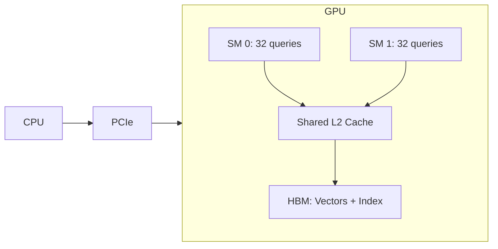

# 11. Hardware Acceleration

The inner loop of vector search — **distance computation** — runs billions of times per second. This chapter covers how hardware features can accelerate it by 10–100×.

---

## 11.1 SIMD (Single Instruction, Multiple Data)

### AVX2: Process 8 Floats Simultaneously

A single AVX2 instruction operates on **256-bit registers** = 8 × float32:

??? example "C++ AVX2-Optimized L2 Distance (click to expand)"
    ```cpp
    --8<-- "src/cpp/distances.cpp:l2_simd"
    ```

### Performance Impact

| Implementation | Throughput (768-dim) | Speedup |
|---------------|---------------------|---------|
| Scalar loop | ~50M dist/sec | 1× |
| AVX2 | ~350M dist/sec | **7×** |
| AVX-512 (where available) | ~600M dist/sec | **12×** |

### Key SIMD Instructions for Vector Search

| Instruction | Width | Operation | Use |
|------------|-------|-----------|-----|
| `_mm256_sub_ps` | 8 × f32 | Subtraction | diff = x - y |
| `_mm256_fmadd_ps` | 8 × f32 | Fused multiply-add | sum += diff * diff |
| `_mm256_dp_ps` | 8 × f32 | Dot product | Inner product |
| `_mm_popcnt_u64` | 64-bit | Population count | Hamming distance |

---

## 11.2 GPU Acceleration

### When GPUs Help

GPUs excel at **batch queries** over large datasets:

$$
\text{GPU speedup} \propto \frac{\text{parallelizable work}}{\text{data transfer cost}}
$$

FAISS GPU can process **10K+ queries/sec** at 1M vectors — but data must fit in GPU memory (24–80 GB).

### GPU Architecture for Vector Search



### CPU vs. GPU Decision Matrix

| Factor | Prefer CPU | Prefer GPU |
|--------|-----------|-----------|
| Query volume | < 100 QPS | > 1000 QPS |
| Batch size | 1 (single query) | 100+ (batch) |
| Index updates | Frequent | Rare (batch rebuild) |
| Memory capacity | > 80 GB | ≤ GPU memory |
| Latency requirement | < 1ms | < 10ms acceptable |

---

## 11.3 FPGA

**Field-Programmable Gate Arrays** offer deterministic latency — no OS jitter, no garbage collection:

| Aspect | GPU | FPGA |
|--------|-----|------|
| Throughput | Very high | High |
| Latency | Variable (μs–ms) | **Deterministic** (ns–μs) |
| Power | 300–700W | 20–75W |
| Programming | CUDA (easy) | Verilog/HLS (hard) |
| Flexibility | High | Low (post-synthesis) |

Microsoft's **Catapult** project used FPGAs for Bing search acceleration.

---

## 11.4 NUMA-Aware Design

On multi-socket servers, accessing **remote NUMA memory** costs 2–3× more than local:

$$
\text{Remote access latency} \approx 2\text{–}3 \times \text{local access latency}
$$

!!! warning "NUMA trap"
    A naïve HNSW implementation that allocates vectors across NUMA nodes will see ~40% latency regression vs. NUMA-aware placement.

### NUMA-Aware Strategies

1. **Pin threads** to NUMA nodes; keep their data local
2. **Shard by NUMA node** — each node has its own index partition
3. **Interleave** for read-heavy workloads where all threads access all data

---

## 11.5 RDMA (Remote Direct Memory Access)

For distributed vector databases, RDMA enables **direct memory-to-memory** data transfer between nodes, bypassing the OS kernel:

| | TCP/IP | RDMA |
|---|---|---|
| CPU involvement | Both sides | Zero-copy |
| Latency | 50–100 μs | 1–3 μs |
| Throughput | 10–25 Gbps | 100+ Gbps |

Used in high-performance vector search clusters where shard-to-shard communication is the bottleneck.

---

## References

1. Johnson, J., Douze, M., & Jégou, H. (2019). *Billion-scale similarity search with GPUs (FAISS)*. IEEE TBD.
2. Intel. *Intel Intrinsics Guide*. https://www.intel.com/content/www/us/en/docs/intrinsics-guide/
3. Putnam, A., et al. (2014). *A Reconfigurable Fabric for Accelerating Large-Scale Datacenter Services (Catapult)*. ISCA.
