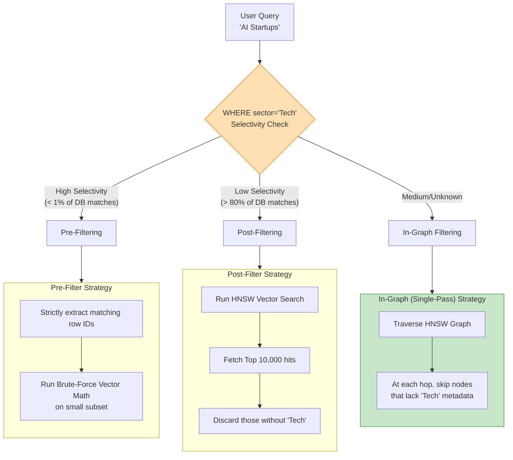

# 10. Hybrid Search

For the first few years of the AI boom, developers believed that Semantic Vector Search would completely replace traditional keyword search (like Elasticsearch or SQL `LIKE` queries). 

We quickly learned this was false. 

If a user searches for *"How do computers talk?"*, a vector search brilliantly understands the semantics, maps it to concepts like networking and TCP/IP, and retrieves fantastic documents perfectly.
However, if an engineer searches for the exact string *"RFC 9110 HTTP"*, a pure vector search often fails miserably, prioritizing text about "internet regulations" instead of the exact technical document string.

**Hybrid Search** solves this by running both algorithms simultaneously and blending the results.

---

## 10.1 Score Fusion (Combining Results)

If BM25 Keyword Search gives a document a score of `15.4`, and Vector Search gives that same document a Cosine Distance score of `0.85` — how do you mathematically combine them to rank the final Top-10? You can't just add them, because they are on completely different scales.

### Reciprocal Rank Fusion (RRF)

RRF is the standard, brilliant trick to bypass the scale problem. It completely ignores the raw mathematical scores, and *only looks at their rank positions*. 

If Document A is the #1 result in Vector Search, but #15 in Keyword search, it gets points based on the fraction $1/\text{rank}$.

$$
\text{RRF}(d) = \sum_{r \in \mathcal{R}} \frac{1}{k + \text{rank}_r(d)}
$$

*Note: $k$ is usually set as an arbitrary smoothing constant like 60 to prevent hyper-penalizing rank 2 vs rank 1.*

!!! tip "Why RRF?"
    RRF is "parameter-free". You don't have to fiddle with weights (e.g., "Make vector search 80% important and keyword 20% important"). It organically surfaces documents that perform moderately well in *both* search algorithms.

### Cross-Encoder Re-Ranking

For absolute state-of-the-art results, production pipelines extract the Top 100 merged results from RRF, and feed them into a heavy, neural **Cross-Encoder model**. A cross-encoder reads both the user's query and the document simultaneously in real-time to output an incredibly accurate relevance score. Because it's too slow to run on a billion documents, we only run it on the top 100 candidates surfaced by Hybrid Search.

---

## 10.2 The Metadata Filtering Flow

Hybrid search doesn't just mean combining keywords with vectors. It also implies combining vectors with hard **database filters** (`WHERE category = 'finance' AND year = 2024`).

Executing an approximate math search over a graph structure while simultaneously enforcing absolute boolean rules is one of the hardest challenges in vector database engineering.



### 1. Pre-Filtering and The Small Subset Problem
In Pre-Filtering, the database evaluates the hard `WHERE` clauses first to generate a "allow list" of valid IDs, and then limits the vector search to only consider those IDs.

However, if your filter is extremely restrictive (e.g. `WHERE user_id = 'alice' AND status = 'active'`), it might eliminate 99.9% of the database. At this point, navigating the massive HNSW graph is mathematically useless. The database skips the graph entirely, does a traditional DB scalar lookup to grab Alice's active records, and calculates the vector distance via simple brute force.

### 2. Post-Filtering and The Over-Fetch Problem
If your filter is extremely broad (e.g. `WHERE is_deleted = False`), the DB runs a lightning fast HNSW graph search first, grabbing the Top 100 items from the graph. It then looks at the metadata for those 100 items and simply throws out the 2 or 3 deleted results. 

The danger here is if you fetch 100 items, and *all* 100 happen to be deleted objects. You return 0 results to the user, even though valid matches existed deeper in the graph.

### 3. In-Graph Filtering: The Percolation Problem
The holy grail of hybrid search is **In-Graph Filtering** (also known as Custom or Single-Pass filtering). As the algorithm hops from neighbor to neighbor inside the HNSW graph, it dynamically checks the metadata of each node and simply ignores neighbors that violate the `WHERE` clause.

However, this introduces the **Percolation Problem**. 
HNSW graphs are built assuming all nodes are connected. If a user applies a rigid filter (e.g., `WHERE color = 'Blue'`), the search algorithm is suddenly "blind" to all red, green, and yellow nodes. If there are no immediate blue neighbors, the algorithm hits a dead end. The graph shatters into disconnected islands, and the search fails to find the true nearest neighbor because it physically cannot traverse the broken graph space.

#### Enterprise Solutions to Percolation

To solve the Percolation Problem, modern vector databases have engineered highly specialized filtering engines:

* **In-Place Filtering (Qdrant):** During ingest, Qdrant analyzes the payload/metadata structure. If it detects distinct categories (like `color: Blue`), it preemptively builds *additional* graph links connecting Blue nodes directly to other Blue nodes, bypassing the Red nodes entirely. When a filtered query arrives, the graph remains perfectly connected regardless of the filter's strictness.
* **Roaring Bitmaps (Weaviate / Milvus):** Instead of relying purely on graph traversal, these databases build specialized inverted indexes running on **Roaring Bitmaps** (a heavily compressed binary array perfect for fast `AND/OR` intersections). The engine intersects the bitmaps to instantly find all valid `Blue` items in microseconds, and then orchestrates a custom HNSW search that is geometrically restricted only to the IDs present in that final bitmap.

---

## 🛠 Assignment: Implement Hybrid Search with Bitmap Filtering

Now let's build the three filtering strategies described above in working C++. You will implement bitmap-based pre-filtering, post-filtering, and compare their accuracy at different filter selectivities.

**Your tasks:**
1. Build a simple `BitmapIndex` for categorical metadata.
2. Implement `pre_filter_search()` — resolve bitmap first, brute-force on valid IDs.
3. Implement `post_filter_search()` — vector search first, discard non-matching.
4. Compare result quality at varying filter selectivities.

```cpp title="Exercise: Hybrid Search with Bitmap Filtering"
#include <iostream>
#include <vector>
#include <algorithm>
#include <random>
#include <cassert>
#include <unordered_map>
#include <unordered_set>
#include <string>
#include <bitset>
#include <cmath>

float l2_dist(const std::vector<float>& a, const std::vector<float>& b) {
    float sum = 0;
    for (size_t i = 0; i < a.size(); ++i) {
        float d = a[i] - b[i]; sum += d * d;
    }
    return sum;
}

struct Result {
    size_t id;
    float distance;
    bool operator<(const Result& o) const { return distance < o.distance; }
};

// ── Step 1: Bitmap Index for categorical metadata ────
// Simulates a Roaring Bitmap. For each category value,
// stores a set of vector IDs that have that value.
class BitmapIndex {
public:
    void add(size_t id, const std::string& category) {
        index_[category].insert(id);
    }

    // Return all IDs matching a category (the "bitmap")
    std::unordered_set<size_t> resolve(const std::string& category) const {
        auto it = index_.find(category);
        if (it != index_.end()) return it->second;
        return {};
    }

    size_t category_count() const { return index_.size(); }

private:
    std::unordered_map<std::string, std::unordered_set<size_t>> index_;
};

// ── Step 2: Pre-Filter Search ────────────────────────
// Resolve the bitmap FIRST, then brute-force ONLY on valid IDs.
// Best for highly selective filters (< 1% of DB matches).
std::vector<Result> pre_filter_search(
    const std::vector<std::vector<float>>& data,
    const std::vector<float>& query,
    const BitmapIndex& bitmap,
    const std::string& filter_value,
    size_t k)
{
    auto valid_ids = bitmap.resolve(filter_value);
    std::vector<Result> results;
    for (size_t id : valid_ids) {
        results.push_back({id, l2_dist(data[id], query)});
    }
    size_t n = std::min(k, results.size());
    std::partial_sort(results.begin(), results.begin() + n, results.end());
    results.resize(n);
    return results;
}

// ── Step 3: Post-Filter Search ───────────────────────
// Run brute-force vector search FIRST, then discard non-matching.
// Best for broad filters (> 80% of DB matches).
std::vector<Result> post_filter_search(
    const std::vector<std::vector<float>>& data,
    const std::vector<float>& query,
    const BitmapIndex& bitmap,
    const std::string& filter_value,
    size_t k,
    size_t overfetch_factor = 10)
{
    // Overfetch: get more candidates than needed
    size_t fetch_k = k * overfetch_factor;
    std::vector<Result> all;
    for (size_t i = 0; i < data.size(); ++i) {
        all.push_back({i, l2_dist(data[i], query)});
    }
    std::partial_sort(all.begin(), all.begin() + fetch_k, all.end());

    // Post-filter: keep only matching IDs
    auto valid_ids = bitmap.resolve(filter_value);
    std::vector<Result> filtered;
    for (size_t i = 0; i < fetch_k && filtered.size() < k; ++i) {
        if (valid_ids.count(all[i].id)) {
            filtered.push_back(all[i]);
        }
    }
    return filtered;
}

// ── Ground Truth: exact filtered k-NN ────────────────
std::vector<Result> exact_filtered_knn(
    const std::vector<std::vector<float>>& data,
    const std::vector<float>& query,
    const BitmapIndex& bitmap,
    const std::string& filter_value,
    size_t k)
{
    auto valid_ids = bitmap.resolve(filter_value);
    std::vector<Result> results;
    for (size_t id : valid_ids) {
        results.push_back({id, l2_dist(data[id], query)});
    }
    size_t n = std::min(k, results.size());
    std::partial_sort(results.begin(), results.begin() + n, results.end());
    results.resize(n);
    return results;
}

float compute_recall(const std::vector<Result>& results,
                     const std::vector<Result>& truth, size_t k) {
    size_t hits = 0;
    for (size_t i = 0; i < std::min(k, results.size()); ++i) {
        for (size_t j = 0; j < std::min(k, truth.size()); ++j) {
            if (results[i].id == truth[j].id) { hits++; break; }
        }
    }
    return static_cast<float>(hits) / k;
}

int main() {
    const size_t N = 5000, DIM = 32, K = 5;
    std::mt19937 rng(42);
    std::uniform_real_distribution<float> fdist(-1.0f, 1.0f);

    // Generate dataset with categorical metadata
    std::vector<std::vector<float>> data(N);
    std::vector<std::string> categories = {"Red", "Blue", "Green", "Yellow"};
    BitmapIndex bitmap;

    for (size_t i = 0; i < N; ++i) {
        data[i].resize(DIM);
        for (auto& x : data[i]) x = fdist(rng);
        bitmap.add(i, categories[i % categories.size()]);
    }

    std::vector<float> query(DIM);
    for (auto& x : query) x = fdist(rng);

    std::string filter = "Blue";  // 25% selectivity

    // Run all strategies
    auto truth   = exact_filtered_knn(data, query, bitmap, filter, K);
    auto pre_res = pre_filter_search(data, query, bitmap, filter, K);
    auto post_res = post_filter_search(data, query, bitmap, filter, K);

    float pre_recall  = compute_recall(pre_res, truth, K);
    float post_recall = compute_recall(post_res, truth, K);

    std::cout << "=== Hybrid Search Bitmap Filtering ===" << std::endl;
    std::cout << "Dataset: " << N << " vectors, Filter: color='"
              << filter << "' (25% selectivity)" << std::endl;
    std::cout << "Pre-Filter  Recall@" << K << ": "
              << pre_recall * 100 << "%" << std::endl;
    std::cout << "Post-Filter Recall@" << K << ": "
              << post_recall * 100 << "%" << std::endl;

    assert(pre_recall == 1.0f && "Pre-filter should be exact for brute-force");
    assert(post_recall >= 0.8f && "Post-filter should have high recall");
    std::cout << "✅ All assertions passed!" << std::endl;
    return 0;
}
```

**Compile and run:**
```bash
g++ -std=c++17 -O2 -o hybrid_bitmap hybrid_bitmap.cpp
./hybrid_bitmap
```

---

## References

1. Cormack, G. V., Clarke, C. L., & Buettcher, S. (2009). *Reciprocal Rank Fusion Outperforms Condorcet and Individual Rank Learning Methods*. SIGIR.
2. Nogueira, R., & Cho, K. (2020). *Passage Re-ranking with BERT*. arXiv.
