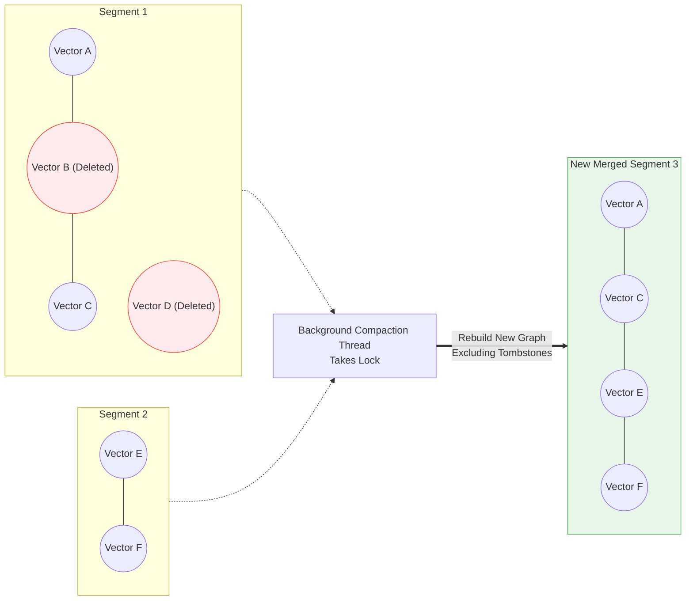

# 9. Real-Time Update Handling

In traditional relational databases (like MySQL), updating a record is mathematically trivial. The engine navigates a B-Tree, finds the specific hard-drive sector where the row lives, and overwrites the text.

In an Approximate Nearest Neighbor vector database, data structures are deeply interconnected geometric graphs or mathematical clusters. If you physically delete "Node X" from an HNSW graph, you might unintentionally sever the only bridging connection between the left side of the graph and the right side of the graph. If that happens, queries will "get stuck" and completely fail to find results on the other side.

Because of this fragility, vector databases handle modifications fundamentally differently than relational databases do.

---

## 9.1 The "Immutable" Segment Paradigm

As discussed in the Storage Engines chapter, to achieve high performance, modern databases write data tightly packed into **Segments**. Once a segment is "Sealed" (e.g., it reaches 100,000 vectors), no process is ever allowed to physically alter the bytes inside that segment file again. It is strictly **immutable**.

So, how do you handle `DELETE` or `UPDATE` API calls from a user if the storage files are immutable?

### Updates as "Delete + Insert"

An `UPDATE` to an embedding is almost never an "update-in-place". If the user updates an embedding, the vector database translates this completely transparently into two independent actions:
1. Issue a `DELETE` command for the old vector ID.
2. Issue an `INSERT` command for the new vector payload (which goes cleanly into the fast, fresh in-memory buffer).

The challenge, therefore, strictly boils down to how to safely execute deletions without breaking the HNSW graph search paths.

---

## 9.2 Soft Deletions and Tombstones

Because we cannot physically rip nodes out of the immutable segment file, we use a concept known as **Soft Deletion** via **Tombstoning**.

A tombstone is simply a mathematical marker. The database maintains a fast, in-memory `Bitset` (an array of billions of `1`s and `0`s), tracking the status of every vector ID. 

### The Deletion Process
When a user deletes ID #4002:
1. The database flips the bit for index 4002 in the deletion bitset to `1`.
2. The vector remains physically inside the HNSW segment on the hard drive. All graph mathematical connections to and from #4002 remain perfectly intact. 

### The Search Process (Filtering Tombstones)
During an incoming query, the HNSW search algorithm navigates the graph exactly as it normally would. It happily hops onto Node #4002 to travel across the graph. 

The only difference occurs at the very end of the search. Once the algorithm collects its "Top 10 Closest Neighbors", it rapidly checks those 10 final IDs against the in-memory Tombstone bitset. If it sees that ID #4002 is flagged as deleted, it simply throws it out of the final results array and pulls in the #11 closest result instead.

It is mathematically elegant, doesn't break graph connectivity, and requires zero complex disk I/O.

---

## 9.3 Hard Deletion and Garbage Collection

Over time, if an application deletes 40% of its vectors, the segments become heavily populated with "ghost nodes". The search algorithm wastes precious millisecond CPU cycles navigating through nodes that are ultimately tossed out. This degrades query performance and wastes expensive RAM.

### Compaction (Graph Repair)

Physical deletion (Hard Deletion) only happens during the background **Compaction** cycle. 



1. A background thread identifies that Segment 1 consists of 40% tombstones.
2. It allocates a brand new memory space.
3. It takes all the *valid* vectors from Segment 1 (and potentially a few other segments).
4. **It rebuilds a brand new HNSW graph structure from scratch** using only the valid vectors.
5. It writes this new pristine graph out to SSD as "Segment 3".
6. It then violently deletes the old Segment 1 and Segment 2 files from the OS entirely.

This ensures the database remains fast and self-maintaining over months of uptime, without impacting the real-time queries.

---

# Assignment: Implement Tombstone Deletions

In this assignment, you will modify the search algorithm from the Chapter 0 Quickstart to smoothly handle Soft Deletions without physically modifying the storage array.

### Goal
Implement a highly efficient `std::vector<bool>` bitset to track deletions. Modify the `search` function to skip any vectors that have been marked as deleted (a Tombstone). 

```cpp title="Exercise: Implement Tombstones"
#include <vector>
#include <iostream>

class TombstoneVectorDB {
private:
    std::vector<Record> storage; // Raw storage
    
    // The Bitset: true implies the record at that index is DELETED.
    std::vector<bool> delete_flags; 

public:
    void delete_vector(size_t index) {
        if (index >= delete_flags.size()) return;
        
        // EXERCISE: Mark the specific index as deleted
        delete_flags[index] = true;
    }

    std::vector<SearchResult> search(const std::vector<float>& query, int k) {
        std::vector<SearchResult> results;

        for (size_t i = 0; i < storage.size(); ++i) {
            // EXERCISE 1: Check the `delete_flags` bitset.
            // If the flag is set to true, `continue` the loop and 
            // completely skip math execution for this ghost node.

            /* Write skip logic here */

            // If not deleted, compute distance
            float dist = calculate_l2(query, storage[i].vector);
            results.push_back({i, dist});
        }

        std::sort(results.begin(), results.end());
        if (results.size() > k) results.resize(k);
        return results;
    }
};
```

---

## References

1. Wang, J., et al. (2021). *Milvus: A Purpose-Built Vector Data Management System*. SIGMOD.
2. Qdrant Documentation. *Storage and Data Management*.
