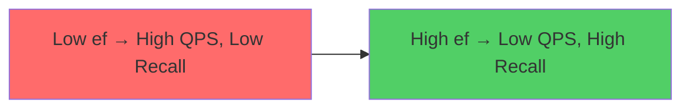

# 17. Benchmark Harness

How do you know which algorithm is best for your data? This chapter covers benchmark methodology, standard datasets, and how to build a fair evaluation harness.

---

## 17.1 The ANN-Benchmarks Framework

[ANN-Benchmarks](https://ann-benchmarks.com/) is the standard evaluation framework. It measures the **recall vs. QPS Pareto frontier**.

### Key Metrics

| Metric | Definition | Interpretation |
|--------|-----------|---------------|
| **Recall@k** | $\frac{\|\text{ANN}(q,k) \cap \text{BF}(q,k)\|}{k}$ | Search quality |
| **QPS** | Queries per second | Throughput |
| **Build time** | Wall-clock index construction | One-time cost |
| **Index size** | Memory footprint (bytes) | Resource cost |
| **p99 latency** | 99th percentile query time | Tail performance |

### The Pareto Frontier

The most informative view is **Recall vs. QPS** at fixed $k$:



An algorithm **dominates** another if it achieves higher recall at the same QPS (or higher QPS at the same recall).

---

## 17.2 Standard Datasets

| Dataset | Vectors | Dimensions | Metric | Size | Use Case |
|---------|---------|-----------|--------|------|----------|
| **SIFT1M** | 1M | 128 | L2 | 512 MB | Quick smoke test |
| **SIFT1B** | 1B | 128 | L2 | 512 GB | Billion-scale |
| **GloVe-200** | 1.2M | 200 | Cosine | 960 MB | NLP embeddings |
| **MNIST** | 60K | 784 | L2 | 188 MB | High-dimensional |
| **Deep1B** | 1B | 96 | L2 | 384 GB | CNN features |
| **LAION-5B** | 5B | 768 | Cosine | 15 TB | CLIP embeddings |

### SIFT1M Format

```
# Binary format: 4-byte int (dim), then dim × 4-byte floats per vector
# File: sift_base.fvecs (128-dim × 1M = 512 MB)
```

---

## 17.3 Fair Evaluation Methodology

### Common Pitfalls

!!! warning "Unfair comparisons to avoid"
    1. **Tuning one algorithm but not the other** — give each the same parameter search budget
    2. **Including build time in QPS** — deceptive for slow-build, fast-query algorithms
    3. **Measuring on the training set** — always use separate query vectors
    4. **Ignoring memory** — an algorithm using 100× more RAM isn't a fair comparison
    5. **Single-threaded vs. multi-threaded** — report both, or fix thread count

### Recommended Protocol

1. **Fix hardware**: Same machine, same CPU, same memory
2. **Fix dataset**: Standard benchmark set (SIFT1M, GloVe)
3. **Parameter sweep**: For each algorithm, try 10+ configurations
4. **Report Pareto**: Plot recall vs. QPS across all configurations
5. **Report memory**: Alongside QPS, report peak RSS
6. **Multiple runs**: Average over 3+ runs to reduce variance

---

## 17.4 Building Your Own Harness

### C++ Benchmark Structure

```cpp
#include <chrono>
#include <vector>

struct BenchmarkResult {
    float recall;
    float qps;
    size_t memory_bytes;
    float build_time_sec;
    float p99_latency_ms;
};

BenchmarkResult run_benchmark(
    /* index */,
    const std::vector<std::vector<float>>& queries,
    const std::vector<std::vector<size_t>>& ground_truth,
    size_t k
) {
    BenchmarkResult result;

    // Measure QPS
    auto start = std::chrono::high_resolution_clock::now();
    size_t total_queries = queries.size();
    size_t correct = 0;

    for (size_t i = 0; i < total_queries; ++i) {
        auto results = /* index.search(queries[i], k) */;

        // Compute recall for this query
        std::set<size_t> gt_set(ground_truth[i].begin(),
                                ground_truth[i].begin() + k);
        for (auto& r : results) {
            if (gt_set.count(r.id)) correct++;
        }
    }

    auto end = std::chrono::high_resolution_clock::now();
    double elapsed = std::chrono::duration<double>(end - start).count();

    result.qps = total_queries / elapsed;
    result.recall = static_cast<float>(correct) / (total_queries * k);
    return result;
}
```

### What to Vary

| Parameter | HNSW | IVF-PQ | LSH |
|-----------|------|--------|-----|
| Build-time | M, ef_construction | nlist, PQ M | num_tables, num_hashes |
| Query-time | ef_search | nprobe | — |

---

## 17.5 Industry Benchmarks and Leaderboards

| Benchmark | Focus | Notable |
|-----------|-------|---------|
| [ANN-Benchmarks](https://ann-benchmarks.com) | Algorithm comparison | Standard reference |
| [Big-ANN-Benchmarks](https://big-ann-benchmarks.com) | Billion-scale | NeurIPS competition |
| [VectorDBBench](https://zilliz.com/vector-database-benchmark-tool) | Full database comparison | Includes filtering |

---

## 🛠 Assignment: Build a Recall-vs-QPS Benchmark Harness

Now let's turn the pseudo-code from Section 17.4 into a fully working benchmark that uses the HNSW index from the book's `src/cpp/` directory. You will sweep the `ef_search` parameter and print a table showing how recall and throughput trade off.

**Your tasks:**
1. Implement `brute_force_ground_truth()` to compute exact k-NN.
2. Implement `measure_recall()` comparing HNSW results to ground truth.
3. Implement `measure_qps()` timing batched queries.
4. Sweep `ef_search` and print a Recall vs QPS table.

```cpp title="Exercise: Recall-vs-QPS Benchmark Harness"
// Compile from src/cpp/:
//   g++ -std=c++17 -O2 -o benchmark benchmark_harness.cpp

#include "hnsw.hpp"   // The HNSW index from the book

#include <iostream>
#include <vector>
#include <algorithm>
#include <random>
#include <chrono>
#include <set>
#include <iomanip>
#include <cassert>

// ── Step 1: Brute-force ground truth ─────────────────
float l2_dist(const std::vector<float>& a, const std::vector<float>& b) {
    float sum = 0;
    for (size_t i = 0; i < a.size(); ++i) {
        float d = a[i] - b[i]; sum += d * d;
    }
    return sum;
}

std::vector<size_t> brute_force_knn(
    const std::vector<std::vector<float>>& dataset,
    const std::vector<float>& query, size_t k)
{
    std::vector<std::pair<float, size_t>> dists;
    for (size_t i = 0; i < dataset.size(); ++i)
        dists.push_back({l2_dist(dataset[i], query), i});
    std::partial_sort(dists.begin(), dists.begin() + k, dists.end());
    std::vector<size_t> result(k);
    for (size_t i = 0; i < k; ++i) result[i] = dists[i].second;
    return result;
}

// ── Step 2: Measure recall@K ─────────────────────────
float measure_recall(
    HNSWIndex& index,
    const std::vector<std::vector<float>>& queries,
    const std::vector<std::vector<size_t>>& ground_truth,
    size_t k)
{
    size_t total_hits = 0;
    for (size_t i = 0; i < queries.size(); ++i) {
        auto results = index.search(queries[i], k);
        std::set<size_t> gt_set(ground_truth[i].begin(),
                                ground_truth[i].end());
        for (const auto& r : results) {
            if (gt_set.count(r.id)) total_hits++;
        }
    }
    return static_cast<float>(total_hits) / (queries.size() * k);
}

// ── Step 3: Measure QPS ──────────────────────────────
float measure_qps(
    HNSWIndex& index,
    const std::vector<std::vector<float>>& queries,
    size_t k)
{
    auto start = std::chrono::high_resolution_clock::now();
    for (const auto& q : queries) {
        index.search(q, k);
    }
    auto end = std::chrono::high_resolution_clock::now();
    double elapsed = std::chrono::duration<double>(end - start).count();
    return static_cast<float>(queries.size()) / elapsed;
}

int main() {
    const size_t N = 10000, DIM = 64, K = 10;
    const size_t NUM_QUERIES = 200;
    std::mt19937 rng(42);
    std::uniform_real_distribution<float> dist(-1.0f, 1.0f);

    // Generate dataset
    std::vector<std::vector<float>> dataset(N);
    for (auto& v : dataset) {
        v.resize(DIM);
        for (auto& x : v) x = dist(rng);
    }

    // Generate queries
    std::vector<std::vector<float>> queries(NUM_QUERIES);
    for (auto& q : queries) {
        q.resize(DIM);
        for (auto& x : q) x = dist(rng);
    }

    // Compute ground truth via brute force
    std::vector<std::vector<size_t>> ground_truth(NUM_QUERIES);
    for (size_t i = 0; i < NUM_QUERIES; ++i) {
        ground_truth[i] = brute_force_knn(dataset, queries[i], K);
    }

    // Build HNSW index (M=16, ef_construction=200)
    HNSWIndex index(DIM, /*M=*/16, /*ef_construction=*/200, /*ef_search=*/10);
    index.build(dataset);

    // ── Step 4: Sweep ef_search and print table ──────
    std::vector<size_t> ef_values = {10, 20, 50, 100, 200, 500};

    std::cout << "=== HNSW Benchmark: Recall vs QPS ===" << std::endl;
    std::cout << "Dataset: " << N << " vectors × " << DIM << "D, "
              << NUM_QUERIES << " queries, K=" << K << std::endl;
    std::cout << std::endl;
    std::cout << std::setw(12) << "ef_search"
              << std::setw(12) << "Recall@K"
              << std::setw(12) << "QPS" << std::endl;
    std::cout << std::string(36, '-') << std::endl;

    for (size_t ef : ef_values) {
        index.set_ef_search(ef);
        float recall = measure_recall(index, queries, ground_truth, K);
        float qps    = measure_qps(index, queries, K);

        std::cout << std::setw(12) << ef
                  << std::setw(11) << std::fixed << std::setprecision(1)
                  << recall * 100 << "%"
                  << std::setw(12) << std::setprecision(0)
                  << qps << std::endl;
    }

    // Verify that high ef_search achieves near-perfect recall
    index.set_ef_search(500);
    float high_recall = measure_recall(index, queries, ground_truth, K);
    assert(high_recall >= 0.95f && "ef_search=500 should achieve >= 95% recall");
    std::cout << "\n✅ Assertion passed: high ef_search recall = "
              << high_recall * 100 << "%" << std::endl;

    return 0;
}
```

**Compile and run** (from `src/cpp/`):
```bash
g++ -std=c++17 -O2 -o benchmark benchmark_harness.cpp
./benchmark
```

---

## References

1. Aumüller, M., Bernhardsson, E., & Faithfull, A. (2020). *ANN-Benchmarks: A Benchmarking Tool for Approximate Nearest Neighbor Algorithms*. Information Systems.
2. Simhadri, H., et al. (2022). *Results of the NeurIPS'21 Challenge on Billion-Scale ANN Search*. NeurIPS.
