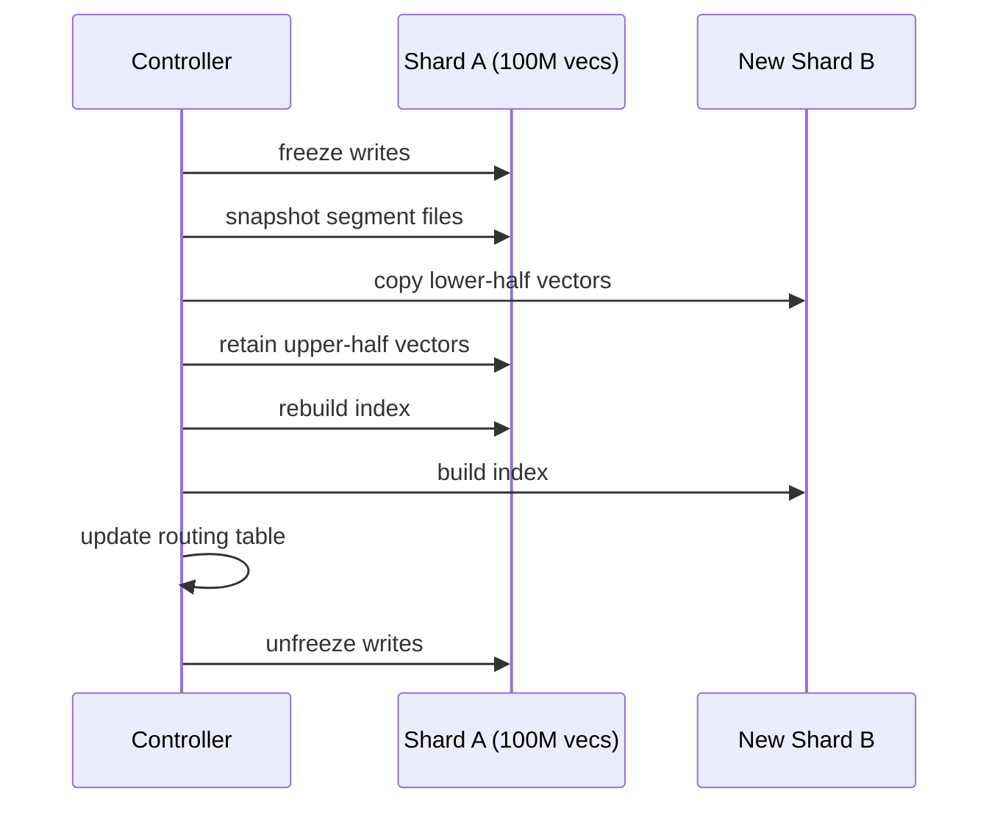

# 16. Elastic Scaling

As data grows or traffic spikes, a vector database must **scale out** (add nodes) and **scale in** (remove nodes) without downtime.

---

## 16.1 Scaling Dimensions

| Dimension | Scale out by | Bottleneck |
|-----------|-------------|-----------|
| **Data volume** | Add shards | Memory / disk per node |
| **Query throughput** | Add read replicas | CPU per node |
| **Write throughput** | Add ingest workers | WAL bandwidth |
| **Index build** | Parallel build across cores | CPU / memory |

---

## 16.2 Shard Split

When a shard exceeds its capacity threshold (e.g., 50M vectors or 80% memory):



### Split Strategies

| Strategy | Method | Pros | Cons |
|----------|--------|------|------|
| **Hash-based** | Split hash range in half | Even distribution | No locality |
| **Cluster-based** | k-means on moved vectors | Better search quality | Uneven sizes |
| **Range-based** | Split by ID range | Simple | Skew-prone |

---

## 16.3 Live Migration

Move a shard from node A to node B without downtime:

1. **Snapshot** the segment on node A
2. **Stream** the snapshot to node B
3. **Replay** WAL entries accumulated during transfer
4. **Atomic switch** — update routing, promote B, demote A

$$
\text{Migration time} \approx \frac{\text{shard size}}{\text{network bandwidth}} + \text{WAL catchup}
$$

For a 10 GB shard on 10 Gbps network: ~8 seconds + catchup.

---

## 16.4 Auto-Scaling Policies

### Reactive Scaling

```
if avg_cpu > 80% for 5 minutes:
    add_replica()
if avg_memory > 85%:
    split_largest_shard()
if avg_cpu < 30% for 15 minutes:
    remove_replica()
```

### Predictive Scaling

Use historical traffic patterns (e.g., 3× spike at 9 AM every weekday) to pre-provision capacity:

$$
\text{target\_replicas}(t) = \left\lceil \frac{\text{predicted\_QPS}(t)}{\text{QPS\_per\_replica}} \right\rceil
$$

---

## 16.5 Zero-Downtime Index Rebuild

When index parameters change (e.g., increase $M$ from 16 to 32):

1. Build new index in background on each shard
2. Warm up new index (load into memory, run test queries)
3. Atomic swap: replace old index with new index
4. Delete old index files

$$
\text{Double memory period} = \text{build time} + \text{warmup time}
$$

---

## 🛠 Assignment: Simulate a Shard Split

Let's implement the shard split algorithm from Section 16.2. You will build a `ShardManager` that detects when a shard exceeds its capacity, splits it using a hash-based strategy, and verifies that search still works correctly after the split.

**Your tasks:**
1. Implement `ShardManager` that holds multiple shard nodes.
2. Implement `detect_overload()` — check if any shard exceeds the threshold.
3. Implement `split_shard()` — redistribute vectors using hash-based splitting.
4. Verify that search results are identical before and after splitting.

```cpp title="Exercise: Shard Split Simulation"
#include <iostream>
#include <vector>
#include <algorithm>
#include <random>
#include <cassert>
#include <cmath>
#include <functional>

float l2_dist(const std::vector<float>& a, const std::vector<float>& b) {
    float sum = 0;
    for (size_t i = 0; i < a.size(); ++i) {
        float d = a[i] - b[i]; sum += d * d;
    }
    return sum;
}

struct SearchResult {
    size_t global_id;
    float distance;
    bool operator<(const SearchResult& o) const { return distance < o.distance; }
};

// ── Shard Node (reused from Ch 8 exercise) ───────────
class ShardNode {
public:
    void add(size_t global_id, const std::vector<float>& vec) {
        ids_.push_back(global_id);
        data_.push_back(vec);
    }

    std::vector<SearchResult> local_search(
        const std::vector<float>& query, size_t k) const {
        std::vector<SearchResult> results;
        for (size_t i = 0; i < data_.size(); ++i)
            results.push_back({ids_[i], l2_dist(data_[i], query)});
        size_t n = std::min(k, results.size());
        std::partial_sort(results.begin(), results.begin() + n, results.end());
        results.resize(n);
        return results;
    }

    size_t size() const { return data_.size(); }

    // Expose internals for splitting
    const std::vector<size_t>& ids() const { return ids_; }
    const std::vector<std::vector<float>>& data() const { return data_; }

private:
    std::vector<size_t> ids_;
    std::vector<std::vector<float>> data_;
};

// ── Shard Manager ────────────────────────────────────
class ShardManager {
public:
    explicit ShardManager(size_t capacity_threshold)
        : threshold_(capacity_threshold) {}

    void add_shard(ShardNode shard) {
        shards_.push_back(std::move(shard));
    }

    // Step 1: Detect if any shard exceeds the capacity limit
    int detect_overload() const {
        for (size_t i = 0; i < shards_.size(); ++i) {
            if (shards_[i].size() > threshold_) return static_cast<int>(i);
        }
        return -1;  // All shards healthy
    }

    // Step 2: Split the overloaded shard using hash-based strategy
    void split_shard(size_t shard_idx) {
        const auto& old = shards_[shard_idx];
        ShardNode left, right;

        // Hash-based split: even hash → left, odd hash → right
        for (size_t i = 0; i < old.size(); ++i) {
            size_t id = old.ids()[i];
            size_t hash = std::hash<size_t>{}(id);
            if (hash % 2 == 0) {
                left.add(id, old.data()[i]);
            } else {
                right.add(id, old.data()[i]);
            }
        }

        // Replace the old shard with two new ones
        shards_.erase(shards_.begin() + shard_idx);
        shards_.push_back(std::move(left));
        shards_.push_back(std::move(right));
    }

    // Scatter-Gather search across all shards
    std::vector<SearchResult> search(const std::vector<float>& query,
                                     size_t k) const {
        std::vector<SearchResult> merged;
        for (const auto& shard : shards_) {
            auto local = shard.local_search(query, k);
            merged.insert(merged.end(), local.begin(), local.end());
        }
        size_t n = std::min(k, merged.size());
        std::partial_sort(merged.begin(), merged.begin() + n, merged.end());
        merged.resize(n);
        return merged;
    }

    size_t num_shards() const { return shards_.size(); }
    size_t shard_size(size_t i) const { return shards_[i].size(); }

private:
    std::vector<ShardNode> shards_;
    size_t threshold_;
};

int main() {
    const size_t N = 2000, DIM = 32, K = 5;
    const size_t SHARD_CAPACITY = 600;
    std::mt19937 rng(42);
    std::uniform_real_distribution<float> dist(-1.0f, 1.0f);

    // Start with a single shard holding everything
    ShardNode initial_shard;
    std::vector<std::vector<float>> all_data(N);
    for (size_t i = 0; i < N; ++i) {
        all_data[i].resize(DIM);
        for (auto& x : all_data[i]) x = dist(rng);
        initial_shard.add(i, all_data[i]);
    }

    ShardManager mgr(SHARD_CAPACITY);
    mgr.add_shard(std::move(initial_shard));

    // Query BEFORE split
    std::vector<float> query(DIM);
    for (auto& x : query) x = dist(rng);
    auto before_results = mgr.search(query, K);

    std::cout << "=== Shard Split Exercise ===" << std::endl;
    std::cout << "Before split: " << mgr.num_shards()
              << " shard(s), " << mgr.shard_size(0) << " vectors" << std::endl;

    // Detect and split overloaded shards
    int overloaded;
    while ((overloaded = mgr.detect_overload()) >= 0) {
        std::cout << "  Splitting shard " << overloaded
                  << " (size=" << mgr.shard_size(overloaded) << ")" << std::endl;
        mgr.split_shard(overloaded);
    }

    std::cout << "After split: " << mgr.num_shards() << " shards" << std::endl;
    for (size_t i = 0; i < mgr.num_shards(); ++i)
        std::cout << "  Shard " << i << ": " << mgr.shard_size(i)
                  << " vectors" << std::endl;

    // Query AFTER split — results must be identical
    auto after_results = mgr.search(query, K);

    bool match = true;
    for (size_t i = 0; i < K; ++i) {
        if (before_results[i].global_id != after_results[i].global_id) {
            match = false; break;
        }
    }

    std::cout << "Search results match: " << (match ? "YES" : "NO") << std::endl;
    assert(match && "Search must return identical results after shard split!");
    std::cout << "✅ Assertion passed!" << std::endl;
    return 0;
}
```

**Compile and run:**
```bash
g++ -std=c++17 -O2 -o shard_split shard_split.cpp
./shard_split
```

---

## References

1. Corbett, J. C., et al. (2013). *Spanner: Google's Globally Distributed Database*. ACM TOCS.
2. Huang, Q., et al. (2020). *AnalyticDB-V: A Hybrid Analytical Engine Towards Query Fusion for Structured and Unstructured Data*. VLDB.
