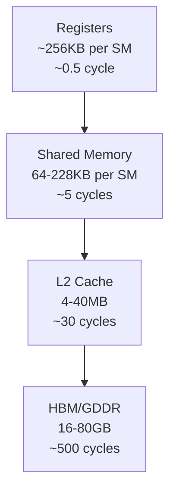

# 14. PQ-IVF on GPUs

GPU-accelerated IVF-PQ is the workhorse of billion-scale vector search. This chapter shows how FAISS-style GPU kernels achieve **10,000+ QPS** on a single GPU.

---

## 14.1 GPU Memory Hierarchy Review



!!! tip "Design principle"
    Keep the **distance lookup table** in shared memory (fits easily: $M \times K \times 4 = 8 \times 256 \times 4 = 8$ KB). Scan PQ codes from HBM — they're compact ($M$ bytes per vector).

---

## 14.2 IVF-PQ on GPU: Execution Model

### Step 1: Coarse Quantizer (Find Nearest Centroids)

```
// Each thread block processes one query
// Find nprobe nearest centroids from nlist candidates
__global__ void find_nearest_centroids(
    const float* queries,     // [nq × d]
    const float* centroids,   // [nlist × d]
    int* nearest_cells,       // [nq × nprobe]
    float* centroid_dists,    // [nq × nprobe]
    int nq, int nlist, int d, int nprobe
);
```

### Step 2: Build Distance Tables

For each query, precompute the $(M \times K)$ distance table:

$$
\text{dt}[m][k] = \|q^{(m)} - c_k^{(m)}\|^2, \quad m \in [0, M), \; k \in [0, 256)
$$

```
// Kernel: one thread block per query
// Each thread computes distances for a subset of (m, k) pairs
// Store result in shared memory for reuse
__global__ void compute_distance_tables(
    const float* queries,       // [nq × d]
    const float* codebooks,     // [M × K × ds]
    float* distance_tables,     // [nq × M × K]
    int nq, int M, int K, int ds
) {
    extern __shared__ float shared_dt[];  // M × K floats

    int qid = blockIdx.x;
    int tid = threadIdx.x;

    // Each thread handles ceil(M*K / blockDim) entries
    for (int idx = tid; idx < M * K; idx += blockDim.x) {
        int m = idx / K;
        int k = idx % K;
        float dist = 0.0f;
        for (int dd = 0; dd < ds; ++dd) {
            float diff = queries[qid * (M * ds) + m * ds + dd]
                       - codebooks[m * K * ds + k * ds + dd];
            dist += diff * diff;
        }
        shared_dt[idx] = dist;
    }
    __syncthreads();

    // Copy to global memory
    for (int idx = tid; idx < M * K; idx += blockDim.x) {
        distance_tables[qid * M * K + idx] = shared_dt[idx];
    }
}
```

### Step 3: Scan PQ Codes

The **inner loop** — scan all codes in selected Voronoi cells:

```
// Each thread block handles one query × one cell
// Threads cooperatively scan PQ codes
__global__ void scan_pq_codes(
    const uint8_t* pq_codes,    // [n × M]
    const float* dist_tables,   // [nq × M × K]
    const int* cell_starts,     // inverted list offsets
    const int* cell_sizes,
    float* top_k_dists,         // [nq × k]
    int* top_k_ids,             // [nq × k]
    int M, int K, int k
) {
    int qid = blockIdx.x;
    int cell = blockIdx.y;

    // Load distance table into shared memory
    extern __shared__ float sdt[];
    for (int i = threadIdx.x; i < M * K; i += blockDim.x)
        sdt[i] = dist_tables[qid * M * K + i];
    __syncthreads();

    // Each thread scans a subset of vectors in this cell
    int start = cell_starts[cell];
    int size = cell_sizes[cell];
    for (int v = threadIdx.x; v < size; v += blockDim.x) {
        float dist = 0.0f;
        const uint8_t* code = &pq_codes[(start + v) * M];
        for (int m = 0; m < M; ++m) {
            dist += sdt[m * K + code[m]];  // Table lookup!
        }
        // Thread-local top-k insertion (heap)
        // ... merge across threads using warp shuffle ...
    }
}
```

---

## 14.3 Performance Analysis

### Arithmetic Intensity

For PQ code scanning, each vector requires:
- $M$ byte loads (PQ codes)
- $M$ float loads (table lookups)  
- $M$ float additions

$$
\text{Arithmetic intensity} = \frac{M \text{ FLOPs}}{M + M \times 4 \text{ bytes}} = \frac{1}{5} \text{ FLOP/byte}
$$

This is **memory-bandwidth bound** — GPU HBM bandwidth (900+ GB/s on A100) is the limiting factor.

### Throughput Model

$$
\text{QPS} = \frac{\text{HBM bandwidth}}{n_{\text{probe}} \cdot \frac{n}{n_{\text{list}}} \cdot M \text{ bytes/query}}
$$

For A100 (2 TB/s), $n = 10^9$, $n_{\text{list}} = 65536$, $n_{\text{probe}} = 64$, $M = 8$:

$$
\text{QPS} \approx \frac{2 \times 10^{12}}{64 \times 15259 \times 8} \approx 256{,}000 \text{ QPS}
$$

!!! info "In practice: ~10K–50K QPS per GPU"
    Overhead from coarse quantizer, kernel launch, and host-device transfer reduces theoretical throughput.

---

## 14.4 Multi-GPU Strategies

| Strategy | Description | Scaling |
|----------|------------|---------|
| **Replicated** | Full index on each GPU | Linear QPS |
| **Sharded** | Partition across GPUs | Linear capacity |
| **Hybrid** | Shard data, replicate codebooks | Best for large datasets |

---

## References

1. Johnson, J., Douze, M., & Jégou, H. (2019). *Billion-scale similarity search with GPUs*. IEEE TBD.
2. FAISS Wiki. *GPU FAQ*. https://github.com/facebookresearch/faiss/wiki/
