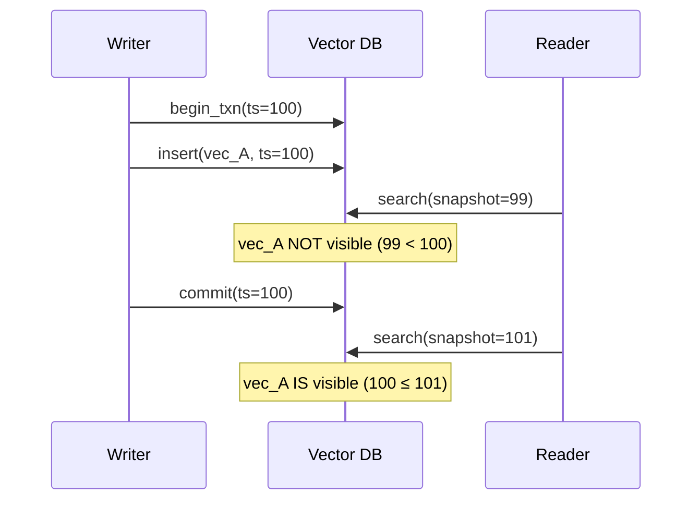

# 15. Transactional Schemes for Vector Data

Traditional databases provide ACID transactions. Vector databases must support **consistent reads during concurrent writes** without degrading search performance.

---

## 15.1 Why Transactions Matter for Vectors

| Scenario | Without transactions | With transactions |
|----------|---------------------|-------------------|
| Update embedding model | Partial old + new vectors visible | Atomic switch |
| Delete + re-insert | Ghost results (deleted but findable) | Consistent view |
| Batch ingestion | Partial batches visible to queries | All-or-nothing |

---

## 15.2 MVCC (Multi-Version Concurrency Control)

### Concept

Each vector version has a **visibility range** $[\text{create\_ts}, \text{delete\_ts})$:

$$
\text{visible}(v, t) = v.\text{create\_ts} \leq t < v.\text{delete\_ts}
$$

Queries execute at a **snapshot timestamp** $t_{\text{snap}}$ and only see vectors visible at that timestamp.

### Implementation

```cpp
struct VersionedVector {
    uint64_t id;
    uint64_t create_ts;       // Timestamp when inserted
    uint64_t delete_ts;       // UINT64_MAX if live
    std::vector<float> data;  // The actual embedding

    bool visible_at(uint64_t snapshot_ts) const {
        return create_ts <= snapshot_ts && snapshot_ts < delete_ts;
    }
};
```

### During Search

```cpp
// In HNSW beam search, skip invisible vectors:
for (size_t neighbor : graph[layer][current]) {
    if (!vectors[neighbor].visible_at(snapshot_ts))
        continue;  // Skip: not visible in this snapshot
    float dist = distance(query, vectors[neighbor].data);
    // ... process candidate ...
}
```

---

## 15.3 Snapshot Isolation for Vector Search

Snapshot isolation guarantees:

1. **Read consistency**: A query sees a consistent state — no torn writes
2. **Non-blocking reads**: Queries don't block insertions (and vice versa)
3. **Write conflicts**: Concurrent updates to the same vector ID are detected



---

## 15.4 Compaction and Garbage Collection

### When to Compact

Old versions accumulate. Compact when:

$$
\frac{\text{dead vectors}}{\text{total vectors}} > \theta \quad \text{(typically } \theta = 0.2\text{)}
$$

### Safe Garbage Collection

Only delete old versions when **no active snapshot** references them:

$$
\text{safe\_to\_gc}(v) = v.\text{delete\_ts} < \min_{s \in \text{active\_snapshots}} s
$$

!!! warning "Long-running queries block GC"
    A query snapshot from 10 minutes ago prevents GC of all versions created since. Use **snapshot timeout** to force-close old snapshots.

---

## 15.5 Comparison with Traditional DBs

| Feature | PostgreSQL (pgvector) | Native Vector DB | This design |
|---------|----------------------|-------------------|-------------|
| ACID | Full | Limited | Snapshot isolation |
| Isolation level | Serializable | Best-effort | Snapshot |
| WAL | Built-in | Custom | Custom |
| Concurrent search + insert | Yes (via MVCC) | Yes (via segments) | Yes (via MVCC) |
| Performance overhead | ~10% | ~0% | ~5% (visibility check) |

---

## References

1. Berenson, H., et al. (1995). *A Critique of ANSI SQL Isolation Levels*. SIGMOD.
2. Tu, S., et al. (2013). *Speedy Transactions in Multicore In-Memory Databases (Silo)*. SOSP.
