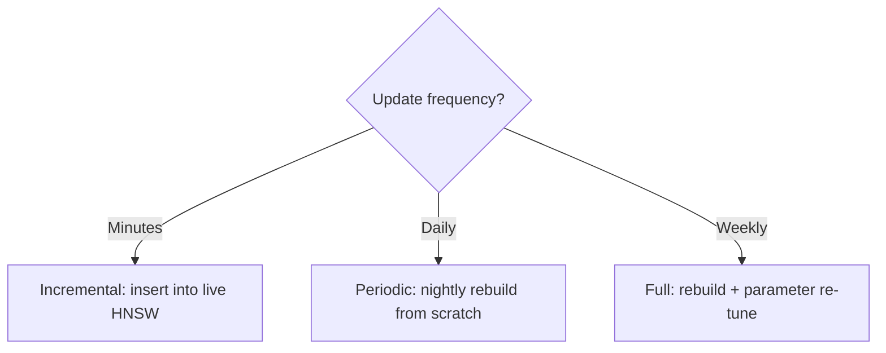

# 19. Continual & Online Learning

Embedding models evolve — new versions offer better quality but produce vectors **incompatible** with existing indexes. This chapter covers strategies for managing embedding updates without rebuilding everything.

---

## 19.1 The Embedding Versioning Problem

When you upgrade from model $v_1$ to $v_2$:

$$
\text{cos}(f_{v_1}(\text{doc}), f_{v_2}(\text{query})) \neq \text{cos}(f_{v_1}(\text{doc}), f_{v_1}(\text{query}))
$$

Old and new embeddings live in **different vector spaces** — distances between them are meaningless.

### Migration Strategies

| Strategy | Downtime | Cost | Quality |
|----------|----------|------|---------|
| **Full re-embed** | None (dual-index) | High (re-compute all) | Best |
| **Lazy re-embed** | None | Gradual | Mixed quality during transition |
| **Compatible training** | None | Training cost | Model may be constrained |
| **Adapter** | None | One-time training | Good but imperfect alignment |

---

## 19.2 Compatibility-Aware Training

Train $v_2$ to produce embeddings **aligned** with $v_1$:

$$
\mathcal{L}_{\text{compat}} = \mathcal{L}_{\text{task}} + \lambda \sum_{i} \|f_{v_2}(x_i) - f_{v_1}(x_i)\|^2
$$

This **backward-compatible** training lets new queries work against old embeddings.

!!! tip "Matryoshka embeddings help"
    Models trained with Matryoshka Representation Learning produce embeddings where the first $k$ dimensions form a valid $k$-dimensional embedding. This enables dimension-adaptive search and gradual migration.

---

## 19.3 Concept Drift Detection

### Monitoring Distribution Shift

$$
\text{MMD}^2(\mathcal{D}_{\text{old}}, \mathcal{D}_{\text{new}}) = \|\mu_{\text{old}} - \mu_{\text{new}}\|^2 + \text{trace}(\Sigma_{\text{old}} + \Sigma_{\text{new}} - 2\Sigma_{\text{cross}})
$$

When the **Maximum Mean Discrepancy** (MMD) between recent and historical embedding distributions exceeds a threshold, trigger alerts.

### Practical Signals

| Signal | Indicates | Action |
|--------|-----------|--------|
| Centroid drift > 5% | Data distribution changed | Retrain IVF centroids |
| Recall drop > 3% | Index quality degraded | Rebuild graph |
| Query-result distance increase | Embedding space diverged | Re-embed or fine-tune |

---

## 19.4 Online Index Updates

### Incremental vs. Periodic Rebuild

### Shadow Index Pattern

1. Build a new index in the background
2. Run a recall test against ground truth
3. If quality ≥ threshold, swap atomically
4. Roll back if quality regresses

---

## References

1. Kusupati, A., et al. (2022). *Matryoshka Representation Learning*. NeurIPS.
2. Shen, Y., et al. (2020). *Backwards-Compatible Representation Learning*. CVPR.
