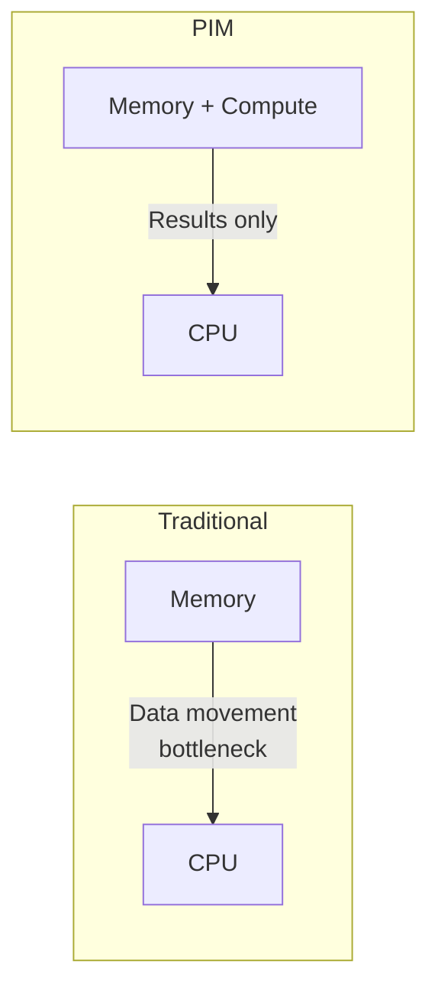
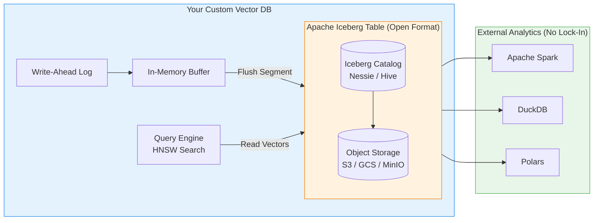

# 21. Future Directions

Vector databases are a rapidly evolving field. This chapter surveys emerging research directions and architectural trends that will shape the next generation of similarity search systems.

---

## 21.1 Learned Indexes

### Beyond Hand-Crafted Data Structures

Traditional indexes (HNSW, IVF) use **fixed algorithms**. Learned indexes replace components with **neural networks** trained on the actual data distribution.

$$
\text{Index}(\mathbf{q}) = f_\theta(\mathbf{q}) \xrightarrow{\text{predicts}} \text{position in sorted data}
$$

### Applications to Vector Search

| Component | Traditional | Learned |
|-----------|------------|---------|
| **Partitioning** | k-means (IVF) | Neural partitioning function |
| **Routing** | Nearest centroid | Learned router (which partition to search) |
| **Distance** | L2 / cosine | Learned metric (Mahalanobis, etc.) |
| **Quantization** | PQ centroids | Anisotropic / rotation-optimized (ScaNN) |

!!! tip "ScaNN is already a learned index"
    Google's ScaNN learns **anisotropic quantization** that accounts for how quantization error affects the ranking, not just reconstruction.

---

## 21.2 Vector SQL and Declarative Query Languages

### The Convergence of SQL and Vector Search

```sql
-- Future: first-class vector operations in SQL
SELECT title, summary,
       vector_distance(embedding, embed('climate change effects')) AS score
FROM documents
WHERE category = 'science'
  AND publication_date > '2023-01-01'
ORDER BY score ASC
LIMIT 20;
```

### Emerging Standards

| System | Approach |
|--------|---------|
| **pgvector** | PostgreSQL extension (`<->` operator) |
| **DuckDB VSS** | Extension for analytical workloads |
| **SingleStore** | Native vector type + dot_product() |
| **LanceDB** | SQL-like API over columnar vector storage |
| **Turbopuffer** | Vector-native with SQL filter expressions |

---

## 21.3 Neuromorphic and In-Memory Computing

### Processing-in-Memory (PIM)

Move computation **to the data** instead of moving data to the CPU:



### Analog Computing for Distance

RRAM (Resistive RAM) crossbar arrays can compute **matrix-vector products** in $O(1)$ time:

$$
\mathbf{y} = W \mathbf{x} \quad \text{computed in a single analog step}
$$

This could enable **constant-time brute-force search** over millions of vectors.

### Optical Computing

Photonic processors perform Fourier transforms at the speed of light, enabling:
- $O(1)$ inner product computation
- Massive parallelism (wavelength division multiplexing)
- Ultra-low power consumption

---

## 21.4 Multi-Modal and Unified Databases

### Beyond Separate Vector Stores

Future databases will natively handle **heterogeneous data types** in a single system:

| Data Type | Representation | Index |
|-----------|---------------|-------|
| Text | Dense embedding | HNSW |
| Images | CLIP vectors | HNSW |
| Structured | Scalar columns | B-tree |
| Graphs | Node embeddings | Graph + HNSW |
| Time series | Segment embeddings | IVF |

### The Universal Embedding Space

Models like **ImageBind** (Meta) and **ONE-PEACE** suggest a future where all modalities exist in a **single embedding space**, enabling truly cross-modal search.

---

## 21.5 Sustainable and Efficient Search

### Energy Cost of Vector Search

$$
\text{Energy per query} = \text{distances computed} \times \text{energy per FLOP}
$$

At datacenter scale (billions of queries/day), vector search energy consumption is non-trivial. Research directions:

- **Cascade search**: Binary quantization → SQ4 → full precision (3-stage)
- **Early termination**: Stop when result quality is "good enough"
- **Workload-aware scheduling**: Batch queries for GPU efficiency
- **Near-data processing**: Reduce data movement

---

## 21.6 Apache Iceberg as a Vector Storage Layer

### The Problem with Proprietary Storage Formats

Every vector database today invents its own internal file format for segments, indexes, and metadata. Milvus has its own binary format, Qdrant stores segments differently, and Weaviate has yet another layout. This means your data is **locked in**. If you want to migrate from Milvus to Qdrant, you must fully export, re-embed, and re-ingest everything—a process that can take days for billion-scale datasets.

### What is Apache Iceberg?

**Apache Iceberg** is an open table format originally designed by Netflix for massive analytical data lakes. It sits on top of commodity object storage (S3, GCS, Azure Blob) and provides:

- **Schema evolution**: Add or remove columns (including embedding columns) without rewriting existing data files.
- **Time-travel queries**: Query the state of your vector index as it was at any historical snapshot (e.g., "What did my embeddings look like last Tuesday?").
- **Partition evolution**: Change how your vectors are physically partitioned across files without a full data migration.
- **ACID transactions**: Concurrent writers can safely insert and compact segments without corrupting the table.

### How to Use Iceberg When Building a Vector DB

If you are designing a vector database from scratch, instead of inventing a proprietary segment format, you can use Iceberg as your **universal storage layer**:

1. **Vector Table Schema**: Define an Iceberg table with columns like `id BIGINT`, `embedding FIXED_SIZE_BINARY(3072)` (for 768 × f32), and `metadata STRING`.
2. **Segment Flushing**: When your in-memory buffer is full (see Chapter 7 Assignment), instead of writing a custom `.bin` segment file, write a Parquet data file registered in the Iceberg catalog. Each "segment" becomes an Iceberg partition.
3. **Compaction as Iceberg Maintenance**: The compaction thread from Chapter 9 maps directly to Iceberg's built-in `rewrite_data_files` operation, which merges small files and removes tombstoned rows.
4. **Interoperability**: Because Iceberg is an open standard, your users can query the raw vector data directly using Spark, Trino, DuckDB, or Polars *without* going through your database's proprietary API. This is incredibly powerful for data science workflows.



> **LanceDB** is already pioneering this approach. Its Lance format is conceptually very similar to an Iceberg table optimized for vector workloads. The industry is converging towards open table formats as the universal storage substrate.

---

## 21.7 ADBC (Arrow Database Connectivity) for Vector Interchange

### The Problem with Custom Clients

Every vector database ships its own Python/Rust/Go SDK with its own serialization format. If you want to bulk-load 50 million embeddings from a pandas DataFrame into Milvus, the SDK serializes each row into JSON or Protobuf, sends it over gRPC, and the server deserializes it back into floats. This **serialization overhead** dominates ingestion time for large datasets—often more time is spent packing/unpacking data than actually building the index.

### What is ADBC?

**ADBC (Arrow Database Connectivity)** is a new database-agnostic API standard built on top of **Apache Arrow**, the universal in-memory columnar format. Think of it as a modern replacement for ODBC/JDBC, but designed for columnar, high-throughput analytical workloads instead of row-by-row transactional systems.

The critical innovation is **zero-copy data exchange**. Because Arrow defines a standardized memory layout for arrays of floats, a client can hand a massive Arrow RecordBatch of 1 million embedding vectors directly to the database driver *without any serialization or deserialization whatsoever*. The database receives a pointer to the exact same memory the client was using.

### How to Use ADBC When Building a Vector DB

If you are building a vector database from scratch, implementing an ADBC driver gives you instant interoperability with the entire Arrow ecosystem:

1. **Bulk Ingestion via Arrow Flight**: Instead of accepting vectors via a slow REST API one-at-a-time, expose an **Arrow Flight** endpoint. The client sends a stream of Arrow RecordBatches containing millions of float arrays. Your database receives them as zero-copy column pointers, dramatically accelerating batch imports.

2. **Native DataFrame Integration**: Data scientists working in Python can use `pyarrow` or `polars` DataFrames to prepare embeddings, then push them directly into your database via the ADBC driver—no JSON conversion, no row-by-row SDK calls.

3. **Cross-Database Portability**: If your database speaks ADBC, a user can trivially pipe data between your system and DuckDB, Postgres, Snowflake, or any other ADBC-compatible system using a universal API.

```python
# Future: Ingesting vectors via ADBC (zero-copy, no serialization)
import adbc_driver_manager
import pyarrow as pa

# 1 million 768-D embeddings, already in Arrow format
embeddings = pa.table({
    "id": pa.array(range(1_000_000)),
    "vector": pa.FixedSizeListArray.from_arrays(
        pa.array(all_floats, type=pa.float32()), 768
    ),
    "text": pa.array(all_texts),
})

# Zero-copy bulk ingest via ADBC
with adbc_driver_manager.connect(driver="your_vectordb") as conn:
    with conn.cursor() as cur:
        cur.adbc_ingest("embeddings_table", embeddings, mode="append")
        # Millions of vectors transmitted with ZERO serialization overhead
```

### The Convergence: Iceberg + ADBC + Vector Search

The most powerful architectural vision for a next-generation vector database combines all three:

| Layer | Technology | Role |
|-------|-----------|------|
| **Client API** | ADBC / Arrow Flight | Zero-copy bulk ingestion and query results |
| **Storage Format** | Apache Iceberg + Parquet | Open, portable, ACID-compliant segment storage |
| **Compute Engine** | Custom HNSW/IVF C++ kernel | High-performance in-memory graph search |

This architecture means your vector database is **never a data silo**. Users can ingest terabytes of embeddings at wire speed, query them via your optimized HNSW engine, and simultaneously analyze the raw data with Spark or DuckDB—all without ever copying or converting a single byte.

---

## 21.8 Open Research Questions

| Question | Why It Matters |
|----------|---------------|
| Can we build ANN indexes with provable guarantees matching LSH but practical like HNSW? | Theory-practice gap |
| How to efficiently handle 10K+ dimension embeddings from frontier models? | Curse of dimensionality |
| Can vector DBs natively support continuous learning without full re-indexing? | Operational cost |
| How to achieve sub-microsecond vector search for edge devices? | IoT and mobile |
| Can we verify search results without revealing the database? | Zero-knowledge proofs |
| Can Iceberg/Lance become the universal open storage format for embeddings? | Vendor lock-in elimination |
| Will ADBC displace proprietary vector DB SDKs for bulk data movement? | Ingestion performance |

---

## References

1. Kraska, T., et al. (2018). *The Case for Learned Index Structures*. SIGMOD.
2. Guo, R., et al. (2020). *Accelerating Large-Scale Inference with Anisotropic Vector Quantization (ScaNN)*. ICML.
3. Sebastian, Y., et al. (2023). *Analog In-Memory Computing for Neural Network Acceleration*. Nature Electronics.
4. Apache Iceberg Documentation. *Table Spec v2*. https://iceberg.apache.org/spec/
5. Apache Arrow ADBC Documentation. https://arrow.apache.org/adbc/
