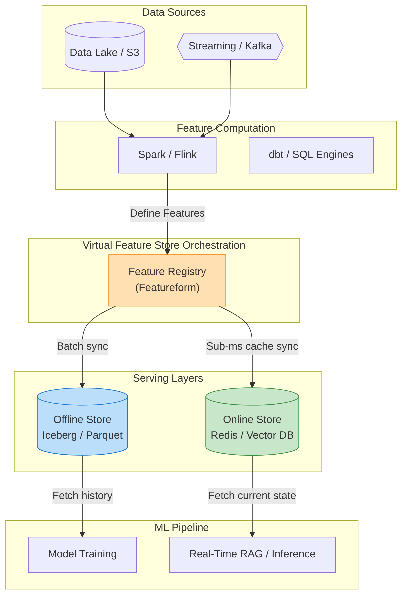

# 24. In-Database ML and Feature Stores

Traditionally, data architecture forces a strict separation between "Storage" and "Compute". Data sits in a database (like PostgreSQL or Weaviate), and Machine Learning happens in a separate Python process (like a PyTorch microservice). 

If you want to re-rank search results or classify a user, your Python microservice must execute a database query, pull 1,000 heavy rows over the network interface, deserialize them into a pandas DataFrame, run the ML model, and throw the data away. 

This **Network I/O bottleneck** dominates the latency of AI applications. This chapter covers the emerging architectural patterns designed to eliminate this bottleneck: pushing ML into the database, and orchestrating these pipelines via Feature Stores.

---

## 24.1 In-Database Machine Learning

Instead of pulling massive amounts of data *to* the compute, In-Database ML pushes the compute directly *to* the data. By running neural networks and aggregations deep inside the database kernel, systems eliminate network I/O, serialization overhead, and microservice complexity.

### PostgresML

**PostgresML** is an architecture that perfectly exemplifies this trend. Built as an extension on top of PostgreSQL, it fundamentally alters what a database is capable of.

Instead of writing a Python microservice to generate user embeddings, you load massive models (like XGBoost, LightGBM, or Hugging Face Transformers) directly into PostgreSQL's shared memory buffers.

```sql
-- Generate embeddings dynamically INSIDE the SQL query engine
SELECT 
    title,
    pgml.embed('intfloat/e5-small-v2', content) AS content_embedding
FROM blog_posts
WHERE published_at > '2024-01-01';
```

**Why this matters:**
1. **Zero Data Movement:** The text strings never leave the database RAM. The transformer model executes locally on the database CPU/GPU, instantly outputting the `float32[]` array right next to the row.
2. **Transactional ML:** A trigger can be configured so that whenever a row is `INSERT`ed, the database automatically invokes the model internally to generate the embedding, guaranteeing the vector index is never out of sync with the raw text.

### FeatureBase and Specialized Bitmaps

While PostgresML handles deep learning, systems like **FeatureBase** tackle the analytics and feature-generation side of ML using radically different mathematics.

If you want to train an ML model on user behavior, you often need to calculate massive aggregations (e.g., "Find all users aged 25-30 who bought an iPhone in the last hour"). 
FeatureBase uses **Roaring Bitmaps**, B-trees, and internally bit-sliced integer representation to execute these aggregations at millions-of-rows-per-millisecond speeds. ML models (like linear regression or clustering) can be compiled to execute *directly against these compressed internal bitmaps* without ever extracting the data into a standard flat Python array.

---

## 24.2 Orchestration and Feature Stores for ML

If you begin pushing compute into various databases (Vectors in Qdrant, ML in PostgresML, Analytics in Snowflake), how do data scientists keep track of the thousands of "Features" necessary to power Retrieval-Augmented Generation (RAG) and recommendation systems?

Enter the **Feature Store**.



### Virtual Feature Stores (Featureform)

The original feature stores (like Uber's Michelangelo) were monolithic databases in themselves. Modern architecture favors **Virtual Feature Stores** like Featureform. 

A virtual feature store acts like "Terraform for ML features." It is declarative. You don't store your vectors inside Featureform; instead, you write configurations that tell the system: *"Calculate this embedding in PostgresML, cache the vector in Qdrant for real-time search, and store the historical logs of the embeddings in an Iceberg table on S3 for offline training."*

### Streaming vs. Batch Unification

The core existential problem a Feature Store solves is **Offline/Online Skew**.

* **Offline Store (Batch):** Data scientists need historically accurate logs of exactly what an embedding or feature looked like 6 months ago to properly train a model without data leakage. 
* **Online Store (Streaming):** Production RAG systems need ultra-fast, sub-millisecond access to the absolute most current version of a vector to serve a live user query.

Feature Stores conceptually treat data streams (via Kafka or Pulsar) as immutable logs. They fan the data out simultaneously: pushing the fresh updates to the fast Vector DB (Online), while appending the historical record to the Data Lake (Offline), ensuring both production servers and data scientists are looking at the exact same mathematical truth.

---

## Conclusion

As the AI ecosystem matures, the boundaries between the "Vector Database", the "Relational Database", and the "Machine Learning Model" will continue to blur. Architectures that minimize the physical distance between the stored bytes and the neural network will fundamentally dominate the next decade of performance engineering.

---

## References

1. PostgresML Documentation. *In-Database Machine Learning*. https://postgresml.org/docs/
2. Featureform Documentation. *The Virtual Feature Store*. https://docs.featureform.com/
3. Roaring Bitmaps. *Consistently faster and smaller compressed bitmaps*. https://roaringbitmap.org/
