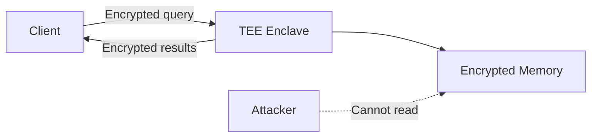

# 18. Privacy-Preserving Vector Search

Embeddings leak information — a user's query embedding reveals their intent, and stored embeddings can be inverted to reconstruct original content. This chapter covers cryptographic and systems-level techniques for private vector search.

---

## 18.1 Why Embeddings Are Sensitive

!!! caution "Embedding inversion attacks"
    Recent work shows that text embeddings can be **inverted** to reconstruct the original input with high fidelity. Storing plaintext embeddings is equivalent to storing the original data.

### Threat Model

| Threat | Description | Mitigation |
|--------|------------|------------|
| **Curious server** | DB operator reads stored embeddings | Encryption at rest |
| **Query sniffing** | Attacker observes query embeddings | Encrypted queries |
| **Membership inference** | Determine if a specific document is in the DB | Differential privacy |
| **Embedding inversion** | Reconstruct original text from embedding | Dimensionality reduction, noise |

---

## 18.2 Homomorphic Encryption (HE)

### Concept

Compute distances on **encrypted vectors** without decrypting:

$$
d(\text{Enc}(\mathbf{q}), \text{Enc}(\mathbf{x})) = \text{Enc}(d(\mathbf{q}, \mathbf{x}))
$$

### Practical Limitations

| Aspect | Plaintext | HE (BFV/CKKS) |
|--------|-----------|---------------|
| L2 distance | ~1 ns | ~10–100 ms |
| Slowdown | 1× | **$10^7$–$10^8$×** |
| Vector packing | N/A | Batch vectors into single ciphertext |

!!! info "CKKS scheme for approximate arithmetic"
    The CKKS scheme supports approximate fixed-point arithmetic on encrypted data — suitable for distance computations that don't need exact results.

---

## 18.3 Secure Multi-Party Computation (MPC)

Split the computation between **two non-colluding parties**:

- **Client** holds the query vector
- **Server** holds the database

Neither party learns the other's inputs. The client only learns the top-$k$ result IDs.

### Secret Sharing

Split each vector element into two shares:

$$
x = x_1 + x_2, \quad x_1 \text{ held by client}, \quad x_2 \text{ held by server}
$$

Distance computation requires **interactive protocols** (oblivious transfer), adding network round trips.

---

## 18.4 Differential Privacy

Add calibrated noise to protect individual records:

$$
\tilde{\mathbf{x}} = \mathbf{x} + \mathcal{N}(0, \sigma^2 I_d)
$$

where $\sigma$ is calibrated to provide $(\varepsilon, \delta)$-differential privacy:

$$
\sigma = \frac{\Delta_2 \sqrt{2 \ln(1.25/\delta)}}{\varepsilon}
$$

| $\varepsilon$ | Privacy level | Recall impact |
|--------------|--------------|---------------|
| 0.1 | Very strong | 15–30% recall drop |
| 1.0 | Strong | 5–10% recall drop |
| 10.0 | Moderate | < 2% recall drop |

---

## 18.5 Trusted Execution Environments (TEEs)

Run vector search inside a **hardware enclave** (Intel SGX/TDX, ARM CCV):

| Aspect | Advantage | Limitation |
|--------|-----------|-----------|
| Security | Hardware-enforced isolation | Side-channel attacks possible |
| Performance | Near-native (5–20% overhead) | Limited enclave memory (256 MB SGX) |
| Trust | No trust in cloud operator needed | Trust in CPU manufacturer |

---

## References

1. Morris, J. X., et al. (2023). *Text Embeddings Reveal (Almost) As Much As Text*. EMNLP.
2. Chen, H., et al. (2022). *SEAL: Microsoft's Homomorphic Encryption Library*.
3. Dwork, C. (2006). *Differential Privacy*. ICALP.
