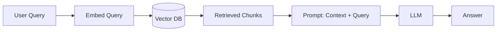
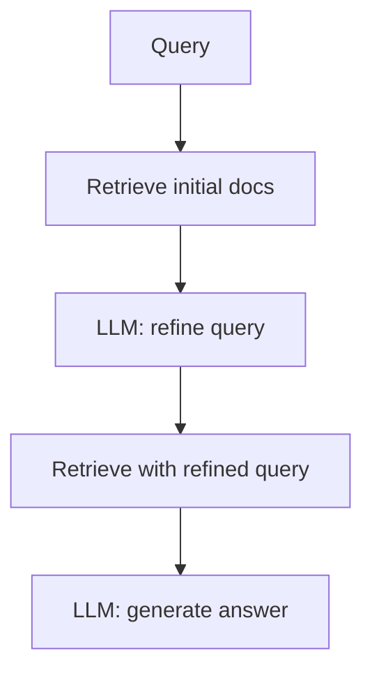
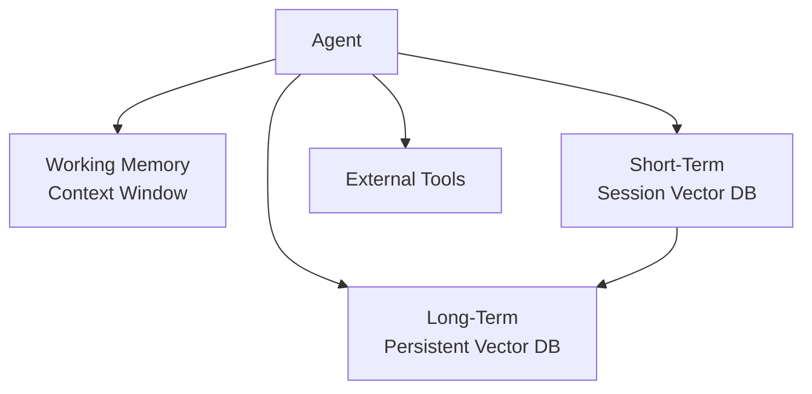

# 20. Vector Databases for Gen-AI Agents

Vector databases are the **memory backbone** of LLM-powered applications. This chapter covers RAG, agentic memory, advanced retrieval patterns, and evaluation.

---

## 20.1 RAG Architecture

### Basic RAG Pipeline



### Naive vs. Production RAG

| Aspect | Naive | Production |
|--------|-------|-----------|
| Retrieval | Single vector search | Hybrid (BM25 + vector) + re-rank |
| Chunking | Fixed 512 tokens | Semantic with overlap |
| Context | Dump all chunks | Select + compress relevant chunks |
| Evaluation | Manual inspection | Automated faithfulness + relevance |

---

## 20.2 Advanced Retrieval Patterns

### HyDE (Hypothetical Document Embeddings)

Instead of embedding the **query**, embed a **hypothetical answer**:

1. LLM generates a hypothetical answer to the query
2. Embed the hypothetical answer
3. Search the vector DB with that embedding

$$
\text{HyDE}: q \xrightarrow{\text{LLM}} \hat{d} \xrightarrow{\text{embed}} \mathbf{v}_{\hat{d}} \xrightarrow{\text{search}} \text{results}
$$

Works better than query embedding because answers are more similar to stored documents than questions are.

### Multi-Step Retrieval



### Parent-Child Retrieval

- **Index**: Embed small chunks (256 tokens) for precise matching
- **Return**: The parent chunk (1024+ tokens) for richer context

---

## 20.3 Agentic Memory

### Short-Term vs. Long-Term Memory

| Memory Type | Stored in | Lifetime | Example |
|------------|-----------|----------|---------|
| **Working memory** | LLM context window | Single turn | Current conversation |
| **Short-term memory** | Vector DB (session-scoped) | Conversation | Chat history embeddings |
| **Long-term memory** | Vector DB (persistent) | Permanent | User preferences, facts |
| **Episodic memory** | Vector DB + metadata | Permanent | Past interactions |

### Memory Architecture for Agents



---

## 20.4 Evaluation Frameworks

### RAG Evaluation Metrics

| Metric | Measures | Formula |
|--------|---------|---------|
| **Faithfulness** | Is the answer grounded in retrieved context? | $\frac{\text{claims supported by context}}{\text{total claims}}$ |
| **Answer Relevancy** | Does the answer address the query? | $\text{cos}(\text{embed}(q), \text{embed}(a))$ |
| **Context Precision** | Are retrieved chunks relevant? | $\text{precision@}k$ with LLM-judged relevance |
| **Context Recall** | Are all needed chunks retrieved? | $\frac{\text{relevant retrieved}}{\text{total relevant}}$ |

### LLM-as-Judge

Use a strong LLM to evaluate retrieval and generation quality:

```
Given the question: {question}
And the retrieved context: {context}
And the generated answer: {answer}

Rate faithfulness (1-5): Is every claim in the answer
supported by the context?
```

### Frameworks

| Framework | Type | Key Feature |
|-----------|------|-------------|
| **RAGAS** | Python library | Automatic metrics (faithfulness, relevancy) |
| **LangSmith** | Platform | Tracing + evaluation |
| **DeepEval** | Python library | Unit tests for LLM outputs |
| **TruLens** | Python library | Feedback functions |

---

## 20.5 Context Window Management

With growing context windows (128K–1M tokens), do we still need RAG?

$$
\text{Cost}_{\text{full context}} = O(n^2) \quad \text{vs.} \quad \text{Cost}_{\text{RAG}} = O(k) + O(k^2)
$$

| | Long Context | RAG |
|---|---|---|
| **Latency** | High (process all tokens) | Low (retrieve k chunks) |
| **Cost** | $$$$ (pay per token) | $ (vector search is cheap) |
| **Accuracy** | "Lost in the middle" problem | Focused on relevant chunks |
| **Scale** | Limited by context window | Unlimited |

---

## References

1. Lewis, P., et al. (2020). *Retrieval-Augmented Generation for Knowledge-Intensive NLP Tasks*. NeurIPS.
2. Gao, L., et al. (2023). *Precise Zero-Shot Dense Retrieval without Relevance Labels (HyDE)*. ACL.
3. Es, S., et al. (2023). *RAGAS: Automated Evaluation of Retrieval Augmented Generation*. arXiv.
